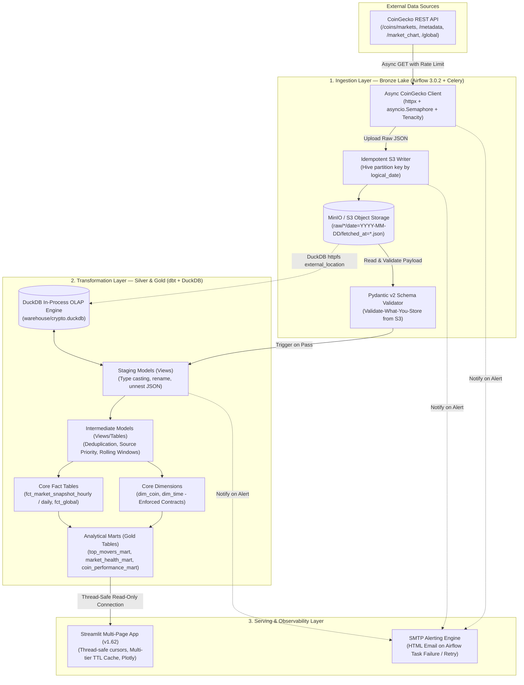
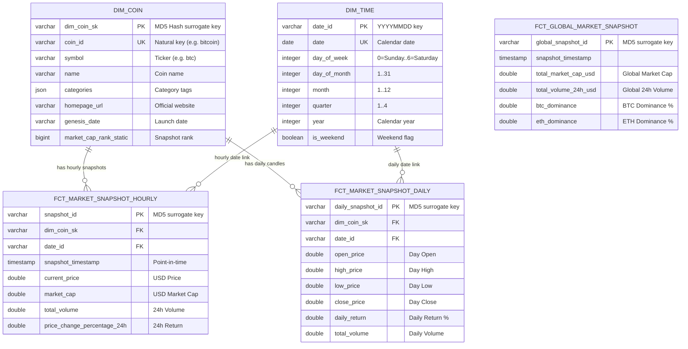

# 🚀 End-to-End Crypto Market Data Engineering Pipeline
### *Production-Grade Modern Data Stack (MDS) Lakehouse & Observability Platform*

[](https://github.com/thanhtri271206/crypto-coin-pipeline/actions/workflows/ci.yml)
[](https://www.python.org/)
[](https://airflow.apache.org/)
[](https://www.getdbt.com/)
[](https://duckdb.org/)
[](https://min.io/)
[](https://streamlit.io/)
[](https://github.com/astral-sh/ruff)
[](https://pytest.org/)
[](https://www.getdbt.com/)
[](https://opensource.org/licenses/MIT)

---

## 📑 Table of Contents (Mục lục)
1. [Project Overview & Problem Statement](#-1-project-overview--problem-statement)
2. [Architecture & Technology Stack](#-2-system-architecture--technology-stack)
   - [End-to-End Architecture Diagram](#end-to-end-architecture-flow)
   - [Technology Stack & Design Decisions (ADR)](#technology-stack--architectural-rationale)
3. [Pipeline Scheduling & Orchestration Cadence](#-3-pipeline-scheduling--orchestration-cadence)
4. [Data Modeling & Warehouse Schema (Kimball)](#-4-data-modeling--warehouse-schema-kimball)
   - [Medallion Architecture](#medallion-architecture-flow)
   - [Star Schema ERD](#dimensional-model-star-schema-erd)
   - [Business Metrics Glossary](#key-business-metrics--analytical-grain)
5. [Key Engineering Highlights](#-5-key-engineering-highlights)
   - [1. Deterministic Idempotency & Hive Partitioning](#1-deterministic-idempotency--hive-partitioning)
   - [2. Async Ingestion with Dual-Tier Resilience](#2-async-ingestion-with-dual-tier-resilience)
   - [3. Dual-Layer Data Quality Gates & Enforced Contracts](#3-dual-layer-data-quality-gates--enforced-contracts)
   - [4. In-Process Vectorized OLAP with DuckDB](#4-in-process-vectorized-olap-with-duckdb)
   - [5. Thread-Safe Multi-User Streamlit Architecture](#5-thread-safe-multi-user-streamlit-architecture)
6. [Analytics & Observability Dashboard](#-6-analytics--observability-dashboard)
7. [Project Directory Tree](#-7-project-structure)
8. [Environment Configuration Reference](#-8-environment-configuration-reference)
9. [Quickstart Guide (Run Locally in 5 Minutes)](#-9-quickstart-guide-run-locally-in-5-minutes)
10. [Automated Testing & Quality Matrix](#-10-automated-testing--quality-matrix)
11. [Operational Runbook & Troubleshooting (FAQ)](#-11-operational-runbook--troubleshooting-faq)
12. [Author & Contact](#-12-author--contact)

---

## 📌 1. Project Overview & Problem Statement

Thị trường tiền mã hóa (Cryptocurrency) hoạt động liên tục **24/7/365** với khối lượng giao dịch khổng lồ và độ biến động giá (volatility) cao. Xây dựng một nền tảng dữ liệu hiện đại phục vụ phân tích kỹ thuật, nghiên cứu định lượng và giám sát thị trường đặt ra các thách thức Data Engineering cốt lõi:

* **API Ingestion Resilience & Rate Limits:** CoinGecko Public/Demo API áp dụng giới hạn request khắt khe (HTTP 429), nguy cơ trôi dạt lược đồ (Schema Drift) và độ trễ mạng bất thường.
* **Deterministic Idempotency:** Đảm bảo khi pipeline rerun, retry do sự cố mạng, hoặc chạy backfill lịch sử thì **không sinh file thừa, không trùng lặp record (zero duplicates)** trên Data Lake và Data Warehouse.
* **Modern Lakehouse Pattern:** Lưu trữ raw payload dưới dạng **Bronze Lake (Hive-partitioned JSON trên MinIO/S3)**, kết hợp công nghệ **In-Process Vectorized OLAP (DuckDB `httpfs`)** để truy vấn trực tiếp dữ liệu thô mà không cần duy trì cluster Spark/Presto đắt đỏ.
* **Kimball Dimensional Modeling:** Chuẩn hóa dữ liệu theo mô hình Star Schema (Fact & Dimension), áp dụng **Data Contracts** nghiêm ngặt và tính toán các chỉ số tài chính nâng cao (Rolling Returns 7D/30D/90D, Volatility, Max Drawdown, Volume Spikes, Market Concentration).
* **Defense-in-Depth Data Quality:** Cơ chế kiểm định chất lượng dữ liệu đa tầng với **Pydantic v2 schemas** trước khi nạp vào Lake, cùng **150+ automated dbt tests** và 5 custom financial assertion rules.
* **Production-Grade Observability:** Hệ thống cảnh báo tự động qua HTML Email (SMTP) khi task Airflow thất bại, kết hợp trang dashboard theo dõi data lineage và telemetry dung lượng kho dữ liệu theo thời gian thực.

---

## 🏗️ 2. System Architecture & Technology Stack

### End-to-End Architecture Flow



### Technology Stack & Architectural Rationale

| Thành phần | Công nghệ lựa chọn | Lý do kiến trúc & Ưu điểm vượt trội |
| :--- | :--- | :--- |
| **Orchestrator** | **Apache Airflow 3.0.2 (Celery)** | Nền tảng điều phối chuẩn enterprise với Redis broker, Celery workers phân tán, Dynamic Task Mapping, và TriggerDagRunOperator. |
| **Object Storage** | **MinIO (Local) / AWS S3 (Prod)** | Lưu trữ phi cấu trúc chuẩn S3 API, hỗ trợ cấu trúc Hive-style partitioning phục vụ pruning partition cực nhanh. |
| **In-Process OLAP** | **DuckDB 1.11+ / 1.12+** | Engine OLAP cột (vectorized columnar engine) đọc trực tiếp parquet/json từ S3 (`httpfs`), không cần tốn chi phí vận hành cụm Spark/Snowflake. |
| **Data Transformation**| **dbt-duckdb 1.12+** | Quản trị vòng đời code SQL theo chuẩn phần mềm (version control, lineage, modularity, macros, documentation, testing). |
| **API Client** | **httpx + asyncio + Tenacity** | Tối ưu hóa I/O concurrency không nghẽn luồng (non-blocking), Semaphore khống chế conccurency, exponential backoff xử lý mã 429. |
| **Data Validation** | **Pydantic v2 + dbt Tests** | Thẩm định 2 chặng: Pre-ingestion (bảo vệ Lake khỏi corrupt JSON) và Post-transformation (bảo vệ Marts khỏi lỗi logic tài chính). |
| **BI & Analytics** | **Streamlit 1.62 + Plotly** | Dashboard tương tác đa trang, dark mode tài chính cao cấp, cache đa tầng (5m / 1h / 24h), thread-local cursor an toàn đa người dùng. |
| **Package Manager** | **uv (Astral)** | Công cụ quản lý package Python bằng Rust với tốc độ resolver & sync nhanh hơn 10-100x so với pip/poetry truyền thống. |

---

## ⚙️ 3. Pipeline Scheduling & Orchestration Cadence

Hệ thống điều phối bao gồm 5 DAGs chạy trên **Apache Airflow 3.0.2**, phân chia rõ ràng theo chu kỳ SLA dữ liệu:

```text
┌──────────────────────────────────────────────────────────────────────────────────┐
│                             AIRFLOW ORCHESTRATION CADENCE                        │
├────────────────────────┬─────────────┬───────────────────┬───────────────────────┤
│ DAG ID                 │ Schedule    │ Loại tác vụ       │ Output Target         │
├────────────────────────┼─────────────┼───────────────────┼───────────────────────┤
│ ingest_market_snapshot │ @hourly     │ Ingestion & Trig  │ raw/coins/markets/    │
│                        │             │                   │ raw/global/           │
│ market_chart_increm... │ @daily      │ Incremental Fetch │ raw/coins/*/chart/    │
│ ingest_coin_metadata   │ @weekly     │ Dynamic Task Map  │ raw/coins_metadata/*/ │
│ market_chart_backfill  │ Manual      │ Historical Init   │ raw/coins/*/chart/    │
│ transform_dag          │ Triggered   │ dbt Build & Test  │ DuckDB Fact/Dim/Marts │
└────────────────────────┴─────────────┴───────────────────┴───────────────────────┘
```

1. **`ingest_market_snapshot` (`@hourly`)**:
   - Tần suất: Chạy vào phút thứ 0 mỗi giờ (`0 * * * *`).
   - Tác vụ: Gọi đồng thời 2 task ingestion (`fetch_top_coins_snapshot` và `fetch_global_market`).
   - Downstream: Khi hoàn thành thành công và vượt qua Pydantic validation, tự động kích hoạt `transform_dag` qua `TriggerDagRunOperator`.
2. **`market_chart_incremental` (`@daily`)**:
   - Tần suất: Chạy lúc 00:30 UTC hàng ngày (`30 0 * * *`).
   - Tác vụ: Fetch cửa sổ trượt 7 ngày nến giá/khối lượng gần nhất của 10 đồng coin nhằm cập nhật nến OHLCV hàng ngày mà không cần fetch lại toàn bộ lịch sử.
3. **`ingest_coin_metadata` (`@weekly`)**:
   - Tần suất: Chạy lúc 00:00 Chủ Nhật hàng tuần (`0 0 * * 0`).
   - Tác vụ: Sử dụng Airflow **Dynamic Task Mapping** (`expand()`) để fetch song song metadata chuyên sâu của danh sách coin từ `config/coins.yaml`.
4. **`market_chart_backfill` (`Manual`)**:
   - Tần suất: Chạy trigger thủ công khi dựng mới môi trường.
   - Tác vụ: Khởi tạo dữ liệu lịch sử nến 365 ngày cho toàn bộ các cặp coin mục tiêu.
5. **`transform_dag` (`Triggered`)**:
   - Tần suất: Được trigger tự động sau mỗi lượt snapshot thành công hoặc trigger thủ công.
   - Tác vụ: Chạy tuần tự `dbt source freshness` $\rightarrow$ `dbt build --select ...` (thực thi cả models và 150 automated tests đồng thời).

---

## 🏛️ 4. Data Modeling & Warehouse Schema (Kimball)

### Medallion Architecture Flow

Dữ liệu được chuyển hóa qua 3 tầng kiến trúc Medallion tiêu chuẩn:

* **🥉 Bronze Layer (Raw Lakehouse):** File JSON thô phân vùng theo Hive format trên S3/MinIO: `raw/{endpoint}/date=YYYY-MM-DD/fetched_at=*.json`. Dữ liệu được bảo toàn nguyên bản từ CoinGecko.
* **🥈 Silver Layer (Staging & Intermediate):**
  * `staging/`: Các View SQL bóc tách JSON bằng DuckDB JSON functions, ép kiểu dữ liệu chuẩn (`timestamp`, `double`, `varchar`).
  * `intermediate/`: Khử trùng lặp (deduplication với `ROW_NUMBER() OVER (...)`), phân giải nguồn ưu tiên (source priority giữa snapshot và historical chart), và tính toán các metrics trượt (rolling averages).
* **🥇 Gold Layer (Marts / Serving):**
  * `core/`: Chuẩn Star Schema với Fact Tables và Conformed Dimension Tables có enforced contracts.
  * `marts/`: Bảng tổng hợp phục vụ trực tiếp cho báo cáo phân tích tài chính và Streamlit BI.

### Dimensional Model (Star Schema ERD)



### Key Business Metrics & Analytical Grain

| Data Mart | Granularity | Các chỉ số tài chính cốt lõi (Core Business Metrics) |
| :--- | :--- | :--- |
| **`coin_performance_mart`** | `dim_coin_sk` + `date_id` | • **Cumulative Returns:** 7-day, 30-day, 90-day returns.<br>• **Volatility:** Độ lệch chuẩn lợi nhuận 30 ngày (`volatility_30d`).<br>• **Max Drawdown:** Mức sụt giảm tối đa từ đỉnh lịch sử (`drawdown_from_ath`). |
| **`top_movers_mart`** | `dim_coin_sk` + `snapshot_timestamp` | • **Gainers & Losers:** Xếp hạng biến động giá 24h (`price_change_rank`).<br>• **Volume Spike Detection:** Tỷ số đột biến khối lượng ($Volume_{24h} / Volume_{Avg7D} > 1.5$). |
| **`market_health_mart`** | `snapshot_timestamp` | • **Dominance Index:** Thị phần vốn hóa BTC & ETH.<br>• **Top 10 Concentration:** Tỷ lệ tập trung vốn hóa của 10 đồng coin lớn nhất thị trường. |

---

## 💡 5. Key Engineering Highlights

### 1. Deterministic Idempotency & Hive Partitioning
* **Vấn đề thường gặp:** Nếu sử dụng thời gian thực thi `datetime.now()` để đặt tên file, mỗi lần Airflow retry hay rerun một task sẽ tạo ra file mới, dẫn tới bùng nổ dữ liệu và trùng lặp bản ghi.
* **Giải pháp áp dụng:** S3 Object Key được cấu hình sinh xác định 100% dựa trên **Airflow `logical_date`**:
  ```text
  raw/{endpoint}/date={YYYY-MM-DD}/fetched_at={YYYY-MM-DDTHH-MM-SSZ}.json
  ```
  Nhờ đó, dù một task retry 3 lần hay được backfill lại cho ngày quá khứ, file cũ luôn được ghi đè chính xác tại partition đó $\rightarrow$ Đạt tính **Idempotent 100%**.

### 2. Async Ingestion with Dual-Tier Resilience
* Tận dụng `httpx.AsyncClient` kết hợp `asyncio.Semaphore(max_concurrency=5)` giúp pipeline fetch dữ liệu từ CoinGecko nhanh hơn 5x mà vẫn kiểm soát được rate limit.
* **Cơ chế phục hồi 2 tầng (Dual-Tier Resilience):**
  * **Tầng 1 (Client Level):** Thư viện `tenacity` cấu hình Exponential Backoff với Jitter (retry từ 2s đến 10s khi gặp HTTP 429 hoặc Network Timeout).
  * **Tầng 2 (Orchestrator Level):** Airflow Task cấu hình `retries=3, retry_delay=timedelta(seconds=30)` xử lý khi API bên ngoài bị gián đoạn kéo dài.

### 3. Dual-Layer Data Quality Gates & Enforced Contracts
* **Pre-Ingestion ("Validate-What-You-Store"):** Python script đọc lại chính file vừa upload lên S3/MinIO để validate thông qua Pydantic v2 schemas (`extra="ignore"` nhằm chống Schema Drift khi CoinGecko bổ sung trường mới) trước khi cho phép kích hoạt tầng Transform.
* **In-Warehouse (dbt Testing):** Bộ **150 data tests** bao gồm cả Generic Tests (`unique`, `not_null`, `accepted_range`, `relationships`) và 5 Custom Financial Assertions:
  - [assert_ohlc_ordering.sql](file:///c:/Users/ADMIN/DE-project/crypto-coin-pipeline/dbt/crypto_dwh/tests/assert_ohlc_ordering.sql): Đảm bảo nguyên lý nến tài chính ($Low \le Open, Close \le High$).
  - [assert_daily_return_range.sql](file:///c:/Users/ADMIN/DE-project/crypto-coin-pipeline/dbt/crypto_dwh/tests/assert_daily_return_range.sql): Bắt lỗi return $<-100\%$ hoặc chia cho 0.
  - [assert_price_positive.sql](file:///c:/Users/ADMIN/DE-project/crypto-coin-pipeline/dbt/crypto_dwh/tests/assert_price_positive.sql) & [assert_market_cap_rank_positive.sql](file:///c:/Users/ADMIN/DE-project/crypto-coin-pipeline/dbt/crypto_dwh/tests/assert_market_cap_rank_positive.sql): Ngăn chặn giá âm hoặc rank $\le 0$.
  - [assert_no_future_snapshots.sql](file:///c:/Users/ADMIN/DE-project/crypto-coin-pipeline/dbt/crypto_dwh/tests/assert_no_future_snapshots.sql): Bắt lỗi lệch múi giờ sinh dữ liệu tương lai.
* **Data Contracts:** Hai bảng Dimension [dim_coin.sql](file:///c:/Users/ADMIN/DE-project/crypto-coin-pipeline/dbt/crypto_dwh/models/marts/core/dim_coin.sql) và [dim_time.sql](file:///c:/Users/ADMIN/DE-project/crypto-coin-pipeline/dbt/crypto_dwh/models/marts/core/dim_time.sql) áp dụng `contract: enforced: true`.

### 4. In-Process Vectorized OLAP with DuckDB
* Tận dụng extension `httpfs` của DuckDB để quét trực tiếp các phân vùng JSON trên MinIO/S3 thông qua cấu hình `external_location` trong dbt-duckdb.
* Đọc dữ liệu dạng columnar vectorized execution giúp DuckDB đạt tốc độ xử lý hàng trăm nghìn dòng dữ liệu chỉ trong vài mili-giây với lượng RAM tiêu thụ cực thấp.

### 5. Thread-Safe Multi-User Streamlit Architecture
* Streamlit chạy trên kiến trúc đa luồng (multi-threaded). Nếu nhiều phiên người dùng cùng gọi truy vấn trên một kết nối DuckDB dùng chung, dễ phát sinh lỗi race condition.
* Ứng dụng triển khai **Thread-Local Cursor Pattern** trong [queries.py](file:///c:/Users/ADMIN/DE-project/crypto-coin-pipeline/app/queries.py):
  ```python
  def _safe_query(sql: str, params: tuple = ()):
      conn = get_db_connection() # Cached read_only connection
      cursor = conn.cursor()     # Thread-safe isolated cursor
      try:
          return cursor.execute(sql, params).df()
      finally:
          cursor.close()
  ```
* Phân tầng TTL bộ nhớ đệm (`@st.cache_data`):
  * `TTL_REALTIME = 300s` (5 phút cho bảng Snapshot giá).
  * `TTL_DAILY = 3600s` (1 giờ cho nến ngày và chỉ số biến động).
  * `TTL_STATIC = 86400s` (24 giờ cho danh mục coin và date spine).

---

## 📊 6. Analytics & Observability Dashboard

Giao diện trực quan hóa dữ liệu được xây dựng bằng **Streamlit 1.62** với giao diện chuẩn Dark Theme tài chính hiện đại:

1. **Trang 1 — Top Movers & Volume Scanner (`1_top_movers.py`):**
   - Bảng xếp hạng Top Gainers / Losers trong 24 giờ.
   - Biểu đồ phân tán (Scatter Plot) phát hiện đột biến khối lượng giao dịch bất thường (Volume Spikes).
2. **Trang 2 — Coin Deep-Dive (`2_coin_deep_dive.py`):**
   - Biểu đồ nến tương tác (Interactive OHLCV Candlestick Chart) tích hợp đường trung bình động MA(7), MA(30).
   - Biểu đồ phân tích độ biến động 30 ngày (Rolling Volatility) và biểu đồ sụt giảm tối đa (Max Drawdown).
3. **Trang 3 — Multi-Coin Comparison (`3_comparison.py`):**
   - Chuẩn hóa lợi nhuận cơ sở (Normalized Percentage Growth) so sánh hiệu suất giữa các đồng tiền mã hóa.
   - Ma trận tương quan biến động giá (Correlation Heatmap) giúp quản trị rủi ro danh mục đầu tư.
4. **Trang 4 — Market Intelligence & Observability (`4_market_intelligence.py`):**
   - Chỉ số sức khỏe vĩ mô: Vốn hóa toàn cầu, tỷ trọng thị phần BTC & ETH Dominance.
   - **Pipeline Observability:** Giám sát dung lượng file vật lý `crypto.duckdb`, số lượng bản ghi của từng tầng bảng, và trực quan hóa sơ đồ dbt Data Lineage.

---

## 📂 7. Project Structure

```text
crypto-coin-pipeline/
├── .github/
│   └── workflows/
│       └── ci.yml               # GitHub Actions CI (Ruff lint, Pytest, dbt compile)
├── .dockerignore                # Root Docker ignore rules (loại trừ env, cache, warehouse)
├── .editorconfig                # Chuẩn hóa format khoảng trắng & ký tự kết dòng UTF-8
├── .gitattributes               # Tự động chuẩn hóa line-ending LF trên mọi hệ điều hành
├── .gitignore                   # Bộ lọc loại trừ credential, parquet, duckdb, venv
├── app/                         # Ứng dụng Streamlit Analytics & Observability
│   ├── pages/
│   │   ├── 1_top_movers.py      # Top gainers/losers & Volume spike scanner
│   │   ├── 2_coin_deep_dive.py  # Phân tích chi tiết từng coin (OHLCV, Drawdown, Volatility)
│   │   ├── 3_comparison.py      # So sánh tương đối hiệu suất & Ma trận tương quan
│   │   └── 4_market_intelligence.py # Chỉ số vĩ mô & Data warehouse observability
│   ├── app.py                   # Điểm khởi chạy app (st.navigation & Material symbols)
│   ├── main.py                  # Trang tổng quan thị trường (Home Overview)
│   ├── charts.py                # Hàm dựng biểu đồ Plotly đồng bộ Dark Theme
│   ├── db.py                    # Singleton quản lý kết nối DuckDB (read_only mode)
│   ├── queries.py               # Data access layer hỗ trợ thread-safe cursor & TTL cache
│   └── theme.py                 # Design tokens, CSS tập trung & từ điển giải nghĩa tiếng Việt
├── config/
│   ├── coins.yaml               # Danh sách đồng tiền mã hóa mục tiêu thu thập
│   └── airflow.cfg              # Cấu hình lõi của Apache Airflow 3.0.2
├── dags/                        # Apache Airflow 3.0.2 DAGs
│   ├── ingest_market_snapshot_dag.py   # DAG snapshot giá hàng giờ & trigger transform
│   ├── ingest_coin_metadata_dag.py     # DAG fetch metadata tuần qua Dynamic Task Mapping
│   ├── market_chart_incremental_dag.py # DAG cập nhật nến giá ngày (cửa sổ trượt 7 ngày)
│   ├── market_chart_backfill_dag.py    # DAG backfill 365 ngày dữ liệu lịch sử
│   ├── transform_dag.py                # DAG điều phối dbt (freshness -> build & test)
│   └── utils/
│       └── alerting.py                 # Module gửi email cảnh báo HTML qua SMTP
├── dbt/crypto_dwh/              # Dự án dbt Core chuyển hóa dữ liệu trên DuckDB
│   ├── macros/
│   │   └── generate_schema_name.sql    # Macro tùy biến schema đặt tên trong DuckDB
│   ├── models/
│   │   ├── staging/             # Silver views: bóc tách JSON thô từ S3 MinIO
│   │   ├── intermediate/        # Deduplication & logic phân giải nguồn ưu tiên
│   │   └── marts/
│   │       ├── core/            # Star Schema: dim_coin, dim_time, fct_market_snapshot_*
│   │       ├── coin_performance/
│   │       │   ├── intermediate/# Metrics trượt (rolling metrics & volume avg)
│   │       │   └── coin_performance_mart.sql
│   │       ├── market_health/   # Chỉ số thanh khoản và nồng độ vốn hóa thị trường
│   │       └── top_movers/      # Top biến động giá và phát hiện dòng tiền bất thường
│   ├── tests/                   # 5 Custom financial SQL assertions (OHLC, Returns, etc.)
│   ├── dbt_project.yml          # Cấu hình models, materialization & clean-targets
│   └── profiles.yml             # Profiles kết nối dev (MinIO), prod (S3), motherduck
├── docker/                      # Hạ tầng Docker Compose đóng gói sẵn
│   ├── airflow/
│   │   ├── .dockerignore        # Loại trừ context build cho image Airflow
│   │   ├── docker-compose.yml   # Airflow 3.0.2 cluster chạy CeleryExecutor
│   │   ├── dockerfile           # Image Airflow tùy biến chứa virtualenv dbt riêng
│   │   ├── requirements-airflow.txt
│   │   └── requirements-dbt.txt
│   └── minio/
│       └── docker-compose.yml   # MinIO Object Storage + Script tự khởi tạo S3 bucket
├── ingestion/                   # Package Python thực thi Ingestion
│   ├── coingecko_client.py      # Async API client kết hợp Semaphore & Tenacity retry
│   ├── config.py                # Module nạp cấu hình ingestion
│   ├── s3_writer.py             # Module ghi dữ liệu S3/MinIO chuẩn Hive Partitioning
│   └── schemas.py               # Pydantic v2 schemas chống trôi dạt lược đồ
├── tests/                       # Bộ kiểm thử tự động (Automated Test Suite)
│   ├── test_coingecko_client.py # Kiểm thử xử lý lỗi mạng và retry của client
│   ├── test_coingecko_split.py  # Kiểm thử phân tách và chuẩn hóa payload API
│   ├── test_s3_writer.py        # Kiểm thử sinh Hive S3 key với thư viện Moto
│   └── test_schema.py           # Kiểm thử tính hợp lệ của Pydantic schemas
├── pyproject.toml               # Quản lý project, scripts & tool configs (uv, ruff, pytest)
├── requirements.txt             # Danh sách thư viện Python đóng băng theo UTF-8
└── .env.example                 # File mẫu cấu hình biến môi trường
```

---

## 🔐 8. Environment Configuration Reference

Hệ thống được cấu hình hoàn toàn thông qua biến môi trường. Sao chép file mẫu và điền thông tin tương ứng:

```bash
cp .env.example .env
```

| Biến môi trường | Bắt buộc | Giá trị mặc định / Mẫu | Mô tả chức năng |
| :--- | :---: | :--- | :--- |
| `COINGECKO_API_KEY` | Không | `your-api-key` | API Key của CoinGecko (Demo hoặc Pro). Để trống nếu dùng free public tier. |
| `S3_BUCKET_NAME` | **Có** | `crypto-raw-lake` | Tên S3 bucket chứa dữ liệu thô Bronze Lake. |
| `S3_ENDPOINT_URL` | **Có** | `http://localhost:9000` | Endpoint MinIO cục bộ (để trống nếu chạy với AWS S3 thật). |
| `AWS_ACCESS_KEY_ID` | **Có** | `adminuser` | Access Key kết nối MinIO / AWS S3. |
| `AWS_SECRET_ACCESS_KEY` | **Có** | `supersecretpassword123` | Secret Key kết nối MinIO / AWS S3. |
| `AWS_DEFAULT_REGION` | **Có** | `ap-southeast-1` | AWS Region cho S3 bucket. |
| `DUCKDB_PATH` | **Có** | `warehouse/crypto.duckdb` | Đường dẫn file cơ sở dữ liệu DuckDB vật lý trên máy host. |
| `DUCKDB_S3_ENDPOINT`| **Có** | `localhost:9000` | Host endpoint cho extension `httpfs` của DuckDB. |
| `AIRFLOW_UID` | **Có** | `50000` | UID của user chạy container Airflow trên Linux/WSL2. |
| `FERNET_KEY` | **Có** | `(Base64 32-byte key)` | Khóa mã hóa Connection & Variable trong DB Airflow. |
| `SMTP_HOST` | Không | `smtp.gmail.com` | Host máy chủ SMTP phục vụ gửi email cảnh báo. |
| `SMTP_PORT` | Không | `587` | Port SMTP (587 cho STARTTLS). |
| `SMTP_USER` | Không | `your-email@gmail.com` | Tài khoản email gửi thông báo. |
| `SMTP_PASSWORD` | Không | `16-char-app-password` | Mật khẩu ứng dụng (App Password) cho SMTP. |
| `ALERT_RECEIVERS` | Không | `admin@example.com` | Danh sách email nhận cảnh báo khi pipeline gặp sự cố. |

---

## 🚀 9. Quickstart Guide (Run Locally in 5 Minutes)

### Yêu cầu hệ thống (Prerequisites)
* [Docker Desktop](https://www.docker.com/) (Bật WSL 2 backend trên Windows hoặc Docker daemon trên Linux/macOS). Tối thiểu 4GB RAM khả dụng.
* [Python 3.12+](https://www.python.org/) & [uv](https://github.com/astral-sh/uv) (Trình quản lý package siêu tốc).

### Bước 1: Clone Repository & Tạo file cấu hình
**Trên Linux / macOS:**
```bash
git clone https://github.com/thanhtri271206/crypto-coin-pipeline.git
cd crypto-coin-pipeline
cp .env.example .env
```

**Trên Windows (PowerShell):**
```powershell
git clone https://github.com/thanhtri271206/crypto-coin-pipeline.git
cd crypto-coin-pipeline
Copy-Item .env.example .env
```

### Bước 2: Cài đặt Dependencies (Siêu tốc với uv)
```bash
# Cài đặt virtual environment và toàn bộ dependencies (ingestion, dbt, app, dev)
uv sync --all-extras
```

### Bước 3: Khởi động Hạ tầng Docker (MinIO & Airflow 3)
```bash
# 1. Khởi động MinIO Object Storage (Data Lake)
docker compose -f docker/minio/docker-compose.yml up -d

# 2. Khởi động cụm Apache Airflow 3.0.2 (PostgreSQL, Redis, Scheduler, Worker, APIServer)
docker compose -f docker/airflow/docker-compose.yml up -d
```

* 📦 **MinIO Console:** [http://localhost:9001](http://localhost:9001) *(User: `adminuser` / Pass: `supersecretpassword123`)*
* ✈️ **Airflow UI:** [http://localhost:8080](http://localhost:8080) *(User: `airflow` / Pass: `airflow`)*

### Bước 4: Kiểm thử Tự động & Biên dịch dbt
```bash
# 1. Chạy toàn bộ 17 Pytest Unit Tests
uv run pytest

# 2. Kiểm tra tĩnh mã nguồn với Ruff
uv run ruff check .

# 3. Biên dịch dbt models & kiểm tra tính toàn vẹn của 150 tests
uv run dbt compile --project-dir dbt/crypto_dwh --profiles-dir dbt/crypto_dwh --target dev
```

### Bước 5: Khởi chạy Streamlit Dashboard
```bash
uv run streamlit run app/app.py
```
* 🌐 Mở trình duyệt tại: **[http://localhost:8501](http://localhost:8501)**

---

## 🧪 10. Automated Testing & Quality Matrix

Dự án áp dụng triệt để phương pháp tiếp cận **Quality First** thông qua ma trận kiểm thử tự động đa tầng:

```text
┌──────────────────────────────────────────────────────────────────────────────────┐
│                             AUTOMATED TESTING MATRIX                             │
├───────────────────┬──────────────┬────────────┬──────────────────────────────────┤
│ Tầng kiểm thử     │ Công nghệ    │ Số lượng   │ Phạm vi xác thực                 │
├───────────────────┼──────────────┼────────────┼──────────────────────────────────┤
│ Static Analysis   │ Ruff Linter  │ Toàn bộ    │ PEP 8, Type hints, Clean Imports │
│ Unit & Mocking    │ Pytest, Moto │ 17 Tests   │ Client retry, S3 keys, Parsers   │
│ Ingestion Schema  │ Pydantic v2  │ 4 Schemas  │ Kiểu dữ liệu thô, Schema Drift   │
│ Schema Freshness  │ dbt fresh    │ 4 Sources  │ SLA trễ dữ liệu của nguồn S3     │
│ Generic Integrity │ dbt-duckdb   │ 145 Tests  │ Unique, Not-null, Accepted-range │
│ Business Rules    │ Singular SQL │ 5 Tests    │ Nến OHLC, Returns, Giá dương     │
│ Data Contracts    │ dbt Core     │ 2 Tables   │ Enforced schema: dim_coin & time │
└───────────────────┴──────────────┴────────────┴──────────────────────────────────┘
```

---

## 🛠️ 11. Operational Runbook & Troubleshooting (FAQ)

<details>
<summary><b>1. Làm thế nào để chạy Backfill dữ liệu lịch sử một năm?</b></summary>

Khi khởi tạo dự án lần đầu trên máy mới, bạn cần dữ liệu lịch sử nến ngày để tính toán các chỉ số 30D/90D rolling.
1. Truy cập Airflow UI tại [http://localhost:8080](http://localhost:8080).
2. Bật (Unpause) DAG `market_chart_backfill`.
3. Nhấn nút **Trigger DAG**. Task sẽ tự động nạp 365 ngày lịch sử cho 10 đồng coins vào MinIO.
4. Sau khi task thành công, kích hoạt `transform_dag` để DuckDB tổng hợp dữ liệu vào các bảng Marts.
</details>

<details>
<summary><b>2. Gặp lỗi DuckDB `IOException: Could not set lock on file ... Resource temporarily unavailable`?</b></summary>

* **Nguyên nhân:** DuckDB là cơ sở dữ liệu nhúng (file-based embedded database). Chỉ có một tiến trình được mở file ở chế độ ghi (`read_write`), trong khi nhiều tiến trình có thể mở đồng thời ở chế độ đọc (`read_only`).
* **Khắc phục:**
  - File [app/db.py](file:///c:/Users/ADMIN/DE-project/crypto-coin-pipeline/app/db.py) của ứng dụng Streamlit đã được cấu hình mặc định `read_only=True` để không bao giờ chiếm lock ghi của Airflow dbt.
  - Nếu bạn mở file `crypto.duckdb` bằng công cụ ngoài (DBeaver, DuckDB CLI), hãy chắc chắn bật flag `-readonly` hoặc đóng kết nối trước khi chạy dbt transform.
</details>

<details>
<summary><b>3. Làm sao để kiểm tra file raw trên MinIO bằng AWS CLI?</b></summary>

Bạn có thể sử dụng `aws-cli` để kiểm tra trực tiếp các file partition được ghi trên MinIO Lakehouse:
```bash
aws --endpoint-url http://localhost:9000 s3 ls s3://crypto-raw-lake/raw/coins/markets/ --recursive
```
*(Yêu cầu cấu hình credentials tương ứng với `AWS_ACCESS_KEY_ID` và `AWS_SECRET_ACCESS_KEY` trong `.env`)*.
</details>

<details>
<summary><b>4. Làm thế nào để reset hoàn toàn môi trường và database?</b></summary>

Nếu muốn dọn dẹp toàn bộ dữ liệu để thử nghiệm từ đầu:
```bash
# 1. Dừng container và xóa volumes
docker compose -f docker/airflow/docker-compose.yml down -v
docker compose -f docker/minio/docker-compose.yml down -v

# 2. Xóa database DuckDB cục bộ
rm warehouse/crypto.duckdb*

# 3. Khởi động lại các container
docker compose -f docker/minio/docker-compose.yml up -d
docker compose -f docker/airflow/docker-compose.yml up -d
```
</details>

---

## 👤 12. Author & Contact

* **Tác giả:** Bui Phan Thanh Tri
* **Vị trí:** Data Engineer
* **Email:** [thanhtri270106@gmail.com](mailto:thanhtri270106@gmail.com)
* **GitHub:** [@thanhtri271206](https://github.com/thanhtri271206)
* **Project Repository:** [thanhtri271206/crypto-coin-pipeline](https://github.com/thanhtri271206/crypto-coin-pipeline)
