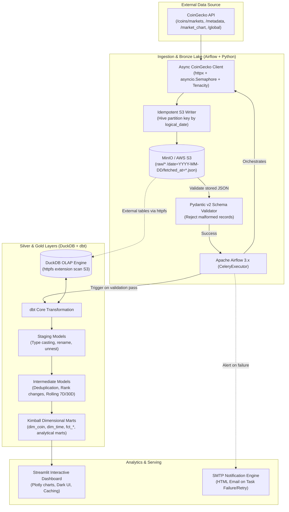

# 🚀 End-to-End Crypto Market Data Engineering Pipeline
### *Production-Grade Modern Data Stack (MDS) Lakehouse & Analytics Platform*

[](https://www.python.org/)
[](https://airflow.apache.org/)
[](https://www.getdbt.com/)
[](https://duckdb.org/)
[](https://min.io/)
[](https://streamlit.io/)
[](https://github.com/astral-sh/ruff)
[](https://pytest.org/)

---

## 📌 1. Project Overview & Business Problem

Thị trường tiền mã hóa (Cryptocurrency) hoạt động **24/7/365** với biến động giá và thanh khoản liên tục. Xây dựng một nền tảng dữ liệu phục vụ nghiên cứu và giám sát thị trường đòi hỏi giải quyết các thách thức kỹ thuật điển hình của một Data Engineer:
* **API Ingestion Resilience:** Xử lý nghiêm ngặt Rate Limits (HTTP 429), Transient Network Drops và Schema Drift từ external APIs (CoinGecko).
* **Idempotency & Data Deduplication:** Đảm bảo khi pipeline rerun hoặc retry theo chu kỳ sẽ **không tạo dữ liệu rác hay trùng lặp**.
* **Modern Lakehouse Architecture:** Lưu trữ raw payload dưới dạng Bronze Data Lake có partition chuẩn Hive, kết hợp công nghệ **In-Process Vectorized OLAP (DuckDB)** để truy vấn trực tiếp từ Object Storage với chi phí hạ tầng bằng 0.
* **Dimensional Modeling:** Mô hình hóa dữ liệu dạng Fact/Dimension (Kimball) phục vụ tính toán Rolling Metrics (MA7, MA30, Volume 24h, Market Dominance) với độ trễ thấp.
* **Dual-Layer Quality Gates:** Kiểm thử 2 tầng gồm **Pydantic v2 schema validation** tại Ingestion và **150+ automated dbt data tests** tại Transformation.

---

## 🏗️ 2. System Architecture



---

## 💡 3. Key Engineering Highlights & Technical Decisions

### 🎯 1. Idempotency & Hive Partitioning in S3/MinIO
* **Vấn đề:** Nếu dùng `datetime.now()` để tạo S3 key, mỗi khi Airflow task bị retry sẽ sinh ra một file mới, dẫn tới trùng lặp dữ liệu trong Data Lake.
* **Giải pháp:** S3 Key được sinh xác định theo **Airflow `logical_date`** (Context Execution Date) theo định dạng:
  ```text
  raw/{endpoint}/date=YYYY-MM-DD/fetched_at=YYYY-MM-DDTHH-MM-SSZ.json
  ```
* Bất kể task retry bao nhiêu lần hoặc backfill cho ngày nào, kết quả ghi đè chính xác partition đó, đảm bảo tính **Idempotent 100%**.

### ⚡ 2. Async Ingestion with Rate-Limiting & Backoff
* Module `CoinGeckoClient` kết hợp:
  * `httpx.AsyncClient` + `asyncio.Semaphore(max_concurrency=5)`: Ngăn chặn nghẽn kết nối và 429 Rate Limit khi gọi đồng thời nhiều coin.
  * `tenacity` exponential backoff: Phân tách rõ lỗi **transient** (429, 5xx, network drops) để retry, và lỗi **non-transient** (404, schema invalid) để fail-fast.
  * Tách biệt hoàn toàn tầng **I/O Fetch (Raw)** và **Validation (Pydantic)**.

### 🛡️ 3. Dual-Layer Data Quality Assurance
1. **Pre-Ingestion (Python + Pydantic v2):** Đọc lại payload từ S3 để validate trước khi cho phép kích hoạt pipeline downstream ("Validate-what-you-store").
2. **In-Warehouse (dbt Data Tests):** Hơn **150 data tests** tự động kiểm tra tính toàn vẹn:
   * Unique, Not Null, Accepted Values, Relationships (Foreign keys).
   * Range checks: Market cap rank $> 0$, Daily price $> 0$, Daily return trong biên độ hợp lý.
   * `dbt source freshness`: Giám sát độ tươi của dữ liệu S3 thông qua regex parse Hive partition filename.

### 🏢 4. Kimball Dimensional Data Modeling
Dữ liệu được tổ chức theo chuẩn Star Schema tại tầng `marts/core`:
* **Dimensions:**
  * `dim_coin`: Thông tin danh mục coin, genesis date, links, platform hash.
  * `dim_time`: Calendar dimension phục vụ drill-down theo Year, Quarter, Month, Day, Day-of-Week.
* **Fact Tables:**
  * `fct_market_snapshot_hourly`: Snapshot giá, volume, market cap từng giờ.
  * `fct_market_snapshot_daily`: Tổng hợp nến ngày (Open, High, Low, Close, Avg Price).
  * `fct_global_market_snapshot`: Chỉ số vĩ mô toàn thị trường (BTC Dominance, Total Market Cap, Total Volume).
* **Domain Marts:** `coin_performance_mart`, `market_health_mart`, `top_movers_mart`.

---

## 📂 4. Project Structure

```text
crypto-coin-pipeline/
├── .github/workflows/       # CI/CD pipelines (Lint, Test, dbt compile)
│   └── ci.yml
├── app/                     # Streamlit BI Dashboard
│   ├── pages/               # Multi-page analytics (Top Movers, Deep Dive, etc.)
│   ├── app.py               # Main navigation entry
│   ├── charts.py            # Plotly dark theme visualizations
│   ├── db.py                # Cached DuckDB connection pool
│   └── queries.py           # Optimized analytical queries
├── dags/                    # Airflow Orchestration DAGs
│   ├── ingest_market_snapshot_dag.py     # Hourly snapshot pipeline
│   ├── ingest_coin_metadata_dag.py       # Weekly metadata ingestion (Dynamic Task Mapping)
│   ├── market_chart_incremental_dag.py   # Daily 7-day incremental market chart
│   ├── market_chart_backfill_dag.py      # Historical backfill pipeline
│   ├── transform_dag.py                  # dbt execution (clean -> deps -> freshness -> build)
│   └── utils/alerting.py                 # Centralized HTML Email Alerting
├── dbt/crypto_dwh/          # dbt Transformation Project
│   ├── models/
│   │   ├── staging/         # Bronze to Silver: read_json_auto from S3
│   │   ├── intermediate/    # Silver: Window deduplication & rolling metrics
│   │   └── marts/           # Gold: Kimball Star Schema & Business marts
│   ├── tests/               # Singular SQL assertion tests
│   ├── dbt_project.yml
│   └── profiles.yml         # Multi-target profile (dev, prod, motherduck)
├── docker/                  # Dockerized Infrastructure
│   ├── airflow/             # Airflow 3.x with CeleryExecutor Dockerfile & compose
│   └── minio/               # S3-compatible local object store with auto-bucket init
├── ingestion/               # Core Python Ingestion Package
│   ├── coingecko_client.py  # Async resilient API client
│   ├── s3_writer.py         # S3/MinIO upload with idempotent partition keys
│   └── schemas.py           # Pydantic v2 strict data contracts
├── tests/                   # Pytest automated test suite (100% pass)
│   ├── test_coingecko_client.py
│   ├── test_coingecko_split.py
│   ├── test_s3_writer.py
│   └── test_schema.py
├── pyproject.toml           # uv project definition & tools config
└── .env.example             # Complete environment configuration template
```

---

## 🚀 5. Quickstart Guide (Run Locally in 5 Minutes)

### Prerequisites
* [Docker & Docker Compose](https://www.docker.com/)
* [Python 3.12+](https://www.python.org/) & [uv](https://github.com/astral-sh/uv) (Fast Python package installer)

### Step 1: Clone Repository & Setup Environment
```bash
git clone https://github.com/thanhtri271206/crypto-coin-pipeline.git
cd crypto-coin-pipeline

# Copy file cấu hình môi trường mẫu
cp .env.example .env
```

### Step 2: Install Local Dependencies (via uv)
```bash
# Cài đặt toàn bộ dependencies bao gồm ingestion, warehouse, dev tools
uv sync --all-extras
```

### Step 3: Start Infrastructure (MinIO & Airflow)
```bash
# 1. Khởi động MinIO (S3 Lakehouse Storage)
docker compose -f docker/minio/docker-compose.yml up -d

# 2. Khởi động Airflow 3.x Cluster (Scheduler, Webserver, Celery Workers, Redis, Postgres)
docker compose -f docker/airflow/docker-compose.yml up -d
```
* **MinIO Console:** [http://localhost:9001](http://localhost:9001) (`adminuser` / `supersecretpassword123`)
* **Airflow UI:** [http://localhost:8080](http://localhost:8080) (`airflow` / `airflow`)

### Step 4: Run Tests & Compile dbt Locally
```bash
# Chạy toàn bộ unit tests
uv run pytest

# Kiểm tra code style
uv run ruff check

# Compile và kiểm tra lineage dbt models
uv run dbt compile --project-dir dbt/crypto_dwh --profiles-dir dbt/crypto_dwh --target dev
```

### Step 5: Launch Streamlit Dashboard
```bash
uv run streamlit run app/app.py
```
Truy cập giao diện phân tích tại: [http://localhost:8501](http://localhost:8501)

---

## 🧪 6. Automated Testing & CI/CD

Dự án tích hợp GitHub Actions CI tự động kiểm tra mã nguồn tại mỗi Pull Request:
* **Code Linting:** `ruff check` tuân thủ chuẩn PEP 8 và Python 3.12 modern idiom.
* **Unit Tests:** `pytest` với `moto` mock S3 storage, test resilience retry và Pydantic data schemas.
* **dbt Compilation:** Kiểm thử cú pháp SQL, Jinja template và dependency DAG graph trước khi merge vào nhánh `main`.

---

## 👤 Author
* **Bui Phan Thanh Tri**
* **Role:** Aspiring Data Engineer
* **Email:** thanhtri270106@gmail.com
* **GitHub:** [@thanhtri271206](https://github.com/thanhtri271206)