# 🚀 End-to-End Crypto Market Data Pipeline

### *A Production-Grade Modern Data Stack — Lakehouse Architecture & Real-Time Observability*

[](https://github.com/thanhtri271206/crypto-coin-pipeline/actions/workflows/ci.yml)
[](https://www.python.org/)
[](https://airflow.apache.org/)
[](https://www.getdbt.com/)
[](https://duckdb.org/)
[](https://motherduck.com/)
[](https://min.io/)
[](https://streamlit.io/)
[](https://crypto-coin-pipeline.streamlit.app/)
[](https://thanhtri271206.github.io/crypto-coin-pipeline/)
[](https://github.com/astral-sh/ruff)
[](https://pytest.org/)
[](https://www.getdbt.com/)
[](https://opensource.org/licenses/MIT)

> **Also available in:** [🇻🇳 Tiếng Việt](README_VN.md)  
> 🌐 **Live Demo App:** [crypto-coin-pipeline.streamlit.app](https://crypto-coin-pipeline.streamlit.app/) | 📖 **Interactive dbt Docs:** [thanhtri271206.github.io/crypto-coin-pipeline](https://thanhtri271206.github.io/crypto-coin-pipeline/)

---


# 🇬🇧 English Version

## 📑 Table of Contents
1. [Project Overview & Motivation](#-1-project-overview--motivation)
2. [System Architecture](#️-2-system-architecture)
3. [Pipeline Orchestration & Scheduling](#️-3-pipeline-orchestration--scheduling)
4. [Data Modeling — Kimball Star Schema](#-4-data-modeling--kimball-star-schema)
5. [Engineering Highlights](#-5-engineering-highlights)
6. [Analytics & Observability Dashboard](#-6-analytics--observability-dashboard)
7. [Project Structure](#-7-project-structure)
8. [Environment Configuration](#-8-environment-configuration)
9. [Quickstart — Run Locally](#-9-quickstart--run-locally)
10. [Testing & Quality Matrix](#-10-testing--quality-matrix)
11. [Operational Runbook & FAQ](#-11-operational-runbook--faq)
12. [Known Limitations & Engineering Roadmap](#-12-known-limitations--engineering-roadmap)
13. [Author & Contact](#-13-author--contact)

---

## 📌 1. Project Overview & Motivation

The cryptocurrency market never sleeps — it runs **24/7/365** with massive trading volumes and extreme price volatility. Building a data platform to support technical analysis, quantitative research, and market monitoring raises some genuinely hard Data Engineering problems.

**The core challenges I set out to solve:**

- **Rate-limited API ingestion:** CoinGecko's public API enforces strict request limits (HTTP 429). Without careful backoff logic and concurrency control, you get throttled requests or partial data.
- **Idempotency at scale:** Every Airflow retry, task rerun, or historical backfill must produce the exact same result — no duplicate files on the lake, no duplicate rows in the warehouse.
- **Cost-effective Lakehouse:** Storing raw JSON in a Hive-partitioned Bronze lake on MinIO/S3, then querying it directly with DuckDB's `httpfs` extension — no Spark cluster to maintain, no Snowflake bills.
- **Dimensional modeling done right:** A proper Kimball Star Schema with enforced data contracts, clean Fact/Dimension separation, and advanced financial metrics (rolling returns, volatility, max drawdown, volume spike detection).
- **Defense-in-depth data quality:** Two independent validation layers — Pydantic v2 at ingestion time, and 150+ automated dbt tests at transformation time. Bad data never reaches the serving layer.
- **Meaningful observability:** Automatic HTML email alerts on any Airflow task failure, plus a live dashboard showing warehouse inventory, table sizes, and dbt data lineage.

---

## 🏗️ 2. System Architecture

### Architecture Diagram

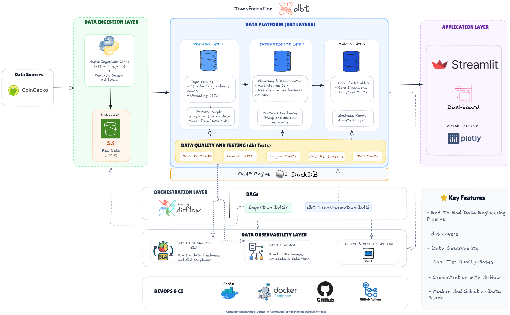

### Data Lineage (dbt-generated)

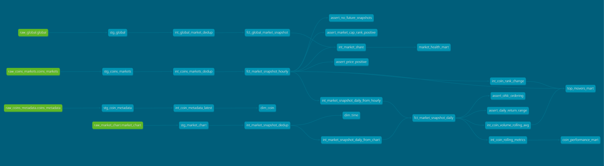

> 📖 **Interactive dbt Documentation & Lineage Graph:** Explore the full interactive model documentation, column descriptions, and lineage graph hosted on GitHub Pages: [https://thanhtri271206.github.io/crypto-coin-pipeline/](https://thanhtri271206.github.io/crypto-coin-pipeline/)

### High-Level Flow

```
CoinGecko REST API
   ↓ httpx AsyncClient + Semaphore + Tenacity retry
Airflow 3.0.2 Celery Worker (Bronze Layer)
   ↓ Idempotent S3 Writer  →  MinIO / S3  (Hive-partitioned JSON)
   ↓ Pydantic v2 validate-what-you-store
   ↓ TriggerDagRunOperator on pass
dbt + DuckDB In-Process OLAP (Silver + Gold Layer)
   staging/ → intermediate/ → core/ (dim_coin, dim_time, fct_*)
                             → marts/ (coin_performance, top_movers, market_health)
   ↓ Thread-safe read-only connection
Streamlit 1.62 Dashboard + SMTP Alerting Engine
```

### Technology Stack & Why These Choices

| Component | Technology | The Reasoning |
| :--- | :--- | :--- |
| **Orchestrator** | **Apache Airflow 3.0.2 (Celery)** | Industry standard with a mature ecosystem. Celery Executor with Redis broker gives real distributed execution — tasks actually run in parallel on separate workers. Dynamic Task Mapping (`expand()`) was a key reason to choose Airflow over simpler alternatives like Prefect or Dagster for this project. |
| **Object Storage** | **MinIO (local) / AWS S3 (prod)** | 100% S3 API compatibility — the same codebase runs locally with MinIO and in production with AWS S3, only env vars change. Hive-style partitioning (`date=YYYY-MM-DD`) enables DuckDB partition pruning during scans. |
| **OLAP & Cloud Warehouse** | **DuckDB 1.11+ / MotherDuck** | The standout architectural choice. DuckDB's `httpfs` extension scans JSON/Parquet directly from S3 without copying data with sub-second execution. Integrated with **MotherDuck** (serverless cloud analytics) to power the Streamlit Cloud deployment and eliminate local DuckDB file-locking concurrency constraints. |
| **Data Transformation** | **dbt-duckdb 1.12+** | dbt brings software engineering discipline to SQL: version control, lineage graphs, automated testing, and documentation. The dbt-duckdb adapter mounts the S3 bucket as `external_location`, letting staging models read directly from MinIO. |
| **API Client** | **httpx + asyncio + Tenacity** | `httpx.AsyncClient` with `asyncio.Semaphore(max_concurrency=5)` fetches all 10 coin charts concurrently (~5x faster than sequential). Tenacity handles exponential backoff (2s → 10s with jitter) for HTTP 429 and network errors. |
| **Schema Validation** | **Pydantic v2** | `ConfigDict(extra="ignore")` is the deliberate design: when CoinGecko adds new fields (schema drift), the validator ignores unknown fields silently. Only declared fields matter, so the pipeline never breaks on API evolution. |
| **BI Dashboard** | **Streamlit 1.62 + Plotly** | Streamlit enables a genuinely useful analytics dashboard in Python without a separate frontend stack. Thread-safe cursor pattern and multi-tier TTL cache (5min/1hr/24hr) handle concurrent users safely despite DuckDB's single-writer constraint. |
| **Package Manager** | **uv (Astral)** | Written in Rust, 10–100x faster than pip for dependency resolution. `uv.lock` ensures reproducible environments across development, CI, and production. |

---

## ⚙️ 3. Pipeline Orchestration & Scheduling

Five DAGs cover the complete data lifecycle:

| DAG ID | Schedule | What it does |
| :--- | :--- | :--- |
| `ingest_market_snapshot` | @hourly | Fetch Top 10 coin prices + global market data → MinIO → Pydantic validate → trigger dbt |
| `market_chart_incremental` | @daily (00:30 UTC) | Sliding 7-day OHLCV window update for all 10 coins |
| `ingest_coin_metadata` | @weekly (Sun 00:00) | Dynamic Task Mapping: fetch metadata for each coin in parallel via `expand()` |
| `market_chart_backfill` | Manual | One-time: load 365 days of historical OHLCV per coin |
| `transform_dag` | Triggered | dbt source freshness → dbt build + all 150 tests (supports selective rebuild) |

**Key design decisions:**

- **`TriggerDagRunOperator`** — `ingest_market_snapshot` triggers `transform_dag` automatically on success, passing `dbt_selector` via `conf` so only the affected model subsets are rebuilt.
- **Selective rebuild** — `transform_dag` reads `dbt_selector` from `dag_run.conf`. A metadata update won't trigger a full rebuild of market snapshot models.
- **Dynamic Task Mapping** — `ingest_coin_metadata` uses `task.expand(coin_id=COIN_IDS)`, fanning out one task per coin with independent retry granularity. Much cleaner than looping inside a single task.
- **`max_active_tasks=10`** — Raised from the default 3 to prevent starvation: 10 coins × 3 tasks = 30 tasks competing for 3 slots would time out without this.

### 📸 Production Airflow UI Evidence

The pipeline runs on an Apache Airflow 3.0.2 Celery cluster with Redis broker and PostgreSQL metadata store:

| Active DAGs Registered | DAG Execution Runs & SLA Status |
| :---: | :---: |
| 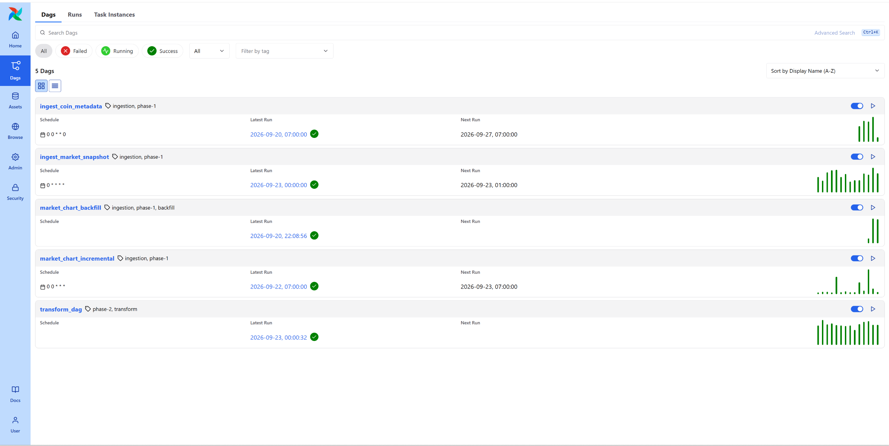 | 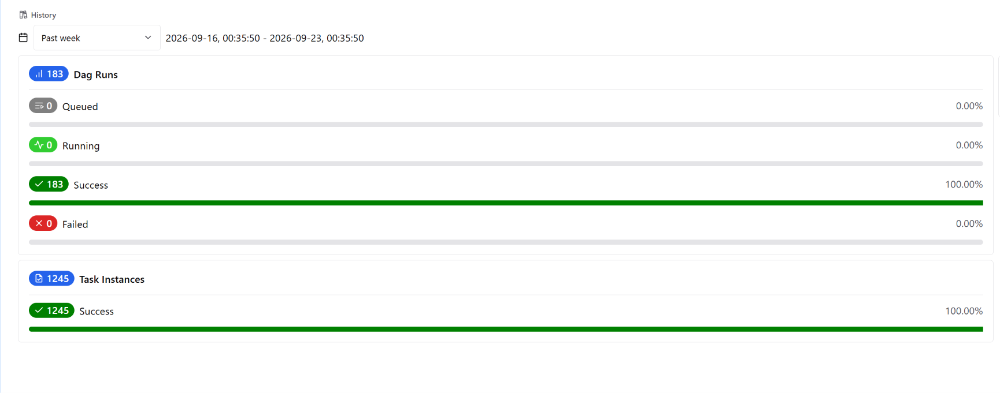 |

---

## 🏛️ 4. Data Modeling — Kimball Star Schema

### Medallion Architecture

```
🥉 BRONZE — Raw Lakehouse (S3/MinIO)
   Path: raw/{endpoint}/date=YYYY-MM-DD/fetched_at=YYYY-MM-DDTHH-MM-SSZ.json
   • Immutable raw API payloads, exactly as received from CoinGecko
   • Hive-partitioned for efficient date-range scanning by DuckDB
   • Retained indefinitely — the authoritative source of truth

   ↓  (DuckDB httpfs reads + dbt staging models parse)

🥈 SILVER — Staging & Intermediate (DuckDB)
   • staging/: SQL views that parse JSON with DuckDB JSON functions,
     cast types (timestamp, double, varchar), and rename columns
   • intermediate/: deduplication via ROW_NUMBER(), source priority
     resolution (snapshot vs. historical chart), rolling window pre-computation

   ↓  (dbt marts models build analytical tables)

🥇 GOLD — Core Star Schema + Analytical Marts (DuckDB)
   • core/: dim_coin, dim_time, fct_market_snapshot_hourly/daily,
     fct_global_market_snapshot — all with enforced data contracts
   • marts/: coin_performance_mart, top_movers_mart, market_health_mart
     — pre-aggregated, business-ready analytical tables
```

### Star Schema ERD

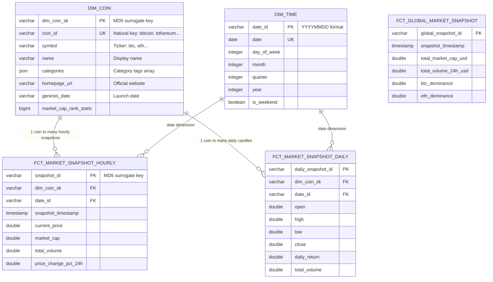

### Analytical Marts & Business Metrics

| Mart | Grain | Core Metrics |
| :--- | :--- | :--- |
| **`coin_performance_mart`** | coin × date | Rolling returns 7D/30D/90D; Volatility (30-day std dev of daily returns); Max Drawdown from ATH |
| **`top_movers_mart`** | coin (latest snapshot) | 24h & 7d price change rankings; Volume Spike (`volume_24h / avg_volume_7d > 1.5`); Extreme anomaly via IQR upper fence |
| **`market_health_mart`** | snapshot timestamp | Total global market cap USD; BTC & ETH dominance %; Top-10 concentration ratio; 24h market cap & volume change % |

---

## 💡 5. Engineering Highlights

### 1 — Deterministic Idempotency via Airflow Logical Date

The most common data lake mistake is using `datetime.now()` to name files. Every retry creates a new file, accumulating duplicates over time.

This pipeline derives the S3 key entirely from Airflow's `logical_date` (the scheduled execution time, not wall-clock):

```
raw/coins/markets/date=2026-08-15/fetched_at=2026-08-15T00-00-00Z.json
```

Three retries on the same hour all write to the **exact same S3 key** — last write wins, cleanly. Backfilling a month of history deterministically writes to the correct partitions without creating orphan files.

### 2 — Async Ingestion with Two-Tier Resilience

**Tier 1 — Client level:** `httpx.AsyncClient` with `asyncio.Semaphore(max_concurrency=5)` allows up to 5 concurrent API calls — fast enough to fetch all 10 coin charts in parallel, conservative enough not to saturate CoinGecko's free-tier limits. Tenacity handles exponential backoff (2s → 10s with jitter) for HTTP 429 and network errors.

**Tier 2 — Orchestrator level:** Every task has `retries=3, retry_delay=30s`. Airflow handles API outages lasting several minutes automatically without manual intervention.

The two tiers target different failure modes: Tier 1 for transient network blips, Tier 2 for extended API outages.

### 3 — Validate-What-You-Store (Dual-Layer Data Quality)

**Pre-ingestion (Pydantic v2):** After uploading raw JSON to S3, the DAG *reads it back from S3* and validates it against Pydantic schemas before triggering the transformation. The "validate-what-you-store" pattern confirms data landed on the lake intact — not just that the API response looked correct in memory.

`ConfigDict(extra="ignore")` is a deliberate choice: schema drift (CoinGecko adding new fields) is silently handled — only declared fields are validated.

**In-warehouse (150 automated dbt tests):**
- **Generic tests**: `unique`, `not_null`, `accepted_range`, `relationships` across all Fact and Dimension tables
- **Custom financial assertions**:
  - `assert_ohlc_ordering.sql` — confirms `Low ≤ Open, Close ≤ High` for every daily candle
  - `assert_daily_return_range.sql` — catches returns < -100% or division-by-zero
  - `assert_price_positive.sql` — no negative prices allowed
  - `assert_market_cap_rank_positive.sql` — no rank ≤ 0
  - `assert_no_future_snapshots.sql` — catches timezone bugs creating "future" records
- **Data contracts**: `dim_coin` and `dim_time` use `contract: enforced: true` — column type changes break the build immediately

### 4 — In-Process OLAP Without a Cluster

The `dbt-duckdb` profile mounts MinIO as `external_location` using the `httpfs` extension:

```yaml
extensions: [httpfs]
settings:
  s3_endpoint: "localhost:9000"
  s3_url_style: "path"   # MinIO requires path-style, unlike AWS virtual-hosted
```

Staging models read directly from S3:
```sql
SELECT * FROM read_json_auto('s3://crypto-raw-lake/raw/coins/markets/date=*/fetched_at=*.json')
```

DuckDB's vectorized columnar engine processes this entirely in memory. No Spark job to submit, no cluster cost, no serialization overhead. For sub-million row datasets, DuckDB outperforms Spark by eliminating distributed overhead entirely.

### 5 — Thread-Safe Multi-User Streamlit Dashboard

Streamlit runs on a multi-threaded server — multiple browser sessions share one Python process. A single shared DuckDB connection object would trigger race conditions under concurrent queries.

Solution: thread-local cursor pattern in [`queries.py`](app/queries.py):

```python
def _safe_query(sql: str, params: list | None = None) -> pd.DataFrame:
    conn = get_conn()      # Cached read-only singleton connection
    cur = conn.cursor()    # New cursor per call — isolated per thread
    try:
        return cur.execute(sql, params).fetchdf()
    finally:
        cur.close()        # Always released, even on exceptions
```

The connection is opened once in `read_only=True` mode — unlimited concurrent readers, never conflicts with Airflow's write lock during dbt transforms.

Cache TTL tiers prevent database hammering on every page refresh:
- `TTL_REALTIME = 300s` — market snapshots, top movers
- `TTL_DAILY = 3600s` — daily OHLCV candles, performance metrics
- `TTL_STATIC = 86400s` — dimension tables (coin list, metadata)

### 6 — Selective dbt Rebuild via DAG Config

When only market snapshot data changes (every hour), there's no reason to rebuild the full dbt graph including weekly metadata models. `transform_dag` reads `dbt_selector` from `dag_run.conf`:

```python
dbt_selector = conf.get("dbt_selector", "").strip()
cmd = f"dbt build --select {dbt_selector}" if dbt_selector else "dbt build"
```

`ingest_market_snapshot` triggers with `conf={"dbt_selector": "stg_coins_markets+ stg_global+"}` — only affected downstream models are rebuilt, saving significant dbt execution time.

---

## 📊 6. Analytics & Observability Dashboard

> 🚀 **Live Demo:** Access the deployed Streamlit Cloud application directly without local setup: [https://crypto-coin-pipeline.streamlit.app/](https://crypto-coin-pipeline.streamlit.app/)

Built with **Streamlit 1.62** and **Plotly** in a bespoke financial dark-theme aesthetic, the dashboard provides a complete analytics and observability suite across 5 core views:

### 📸 Dashboard Visual Gallery

| Market Overview (Home) | Top Movers & Volume Scanner (Page 1) |
| :---: | :---: |
| 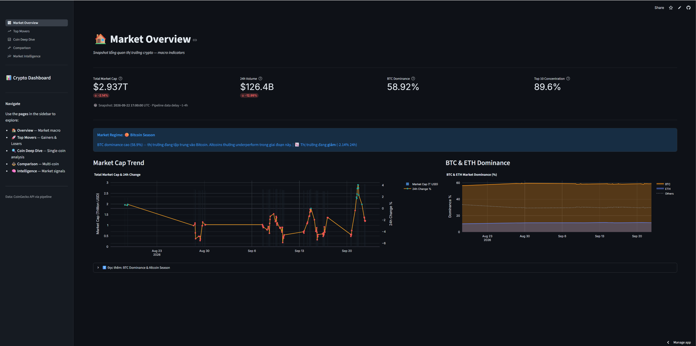 | 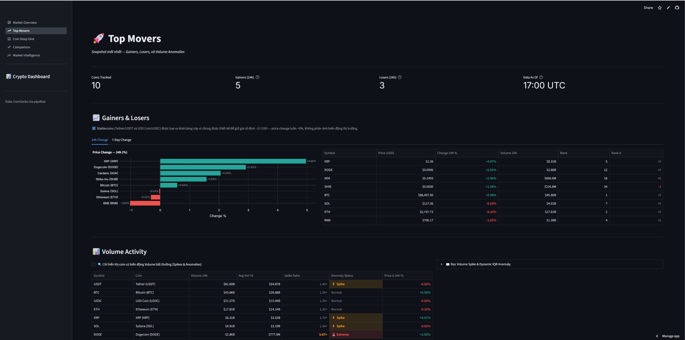 |
| **Coin Deep-Dive & Financial Indicators (Page 2)** | **Multi-Coin Performance Comparison (Page 3)** |
| 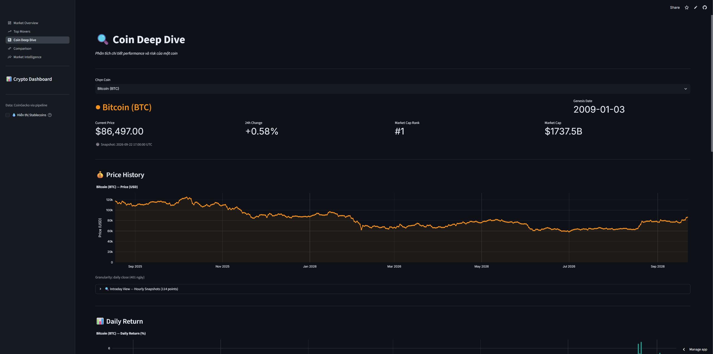 | 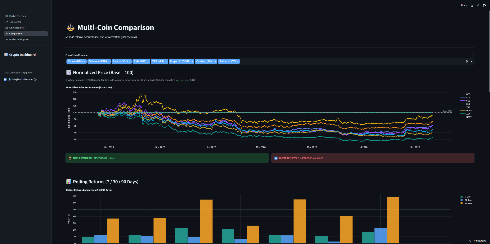 |
| **Global Market Intelligence (Page 4)** | **Warehouse & Lineage Observability (Page 4)** |
| 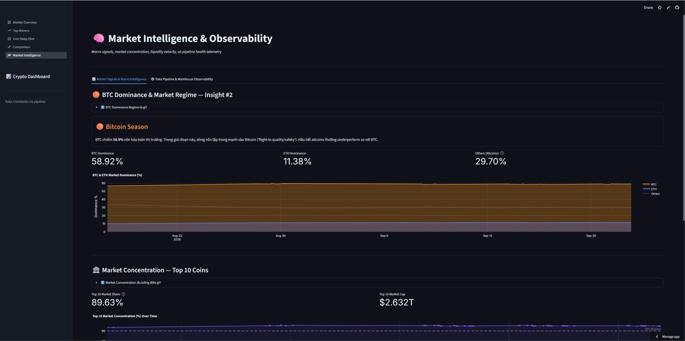 | 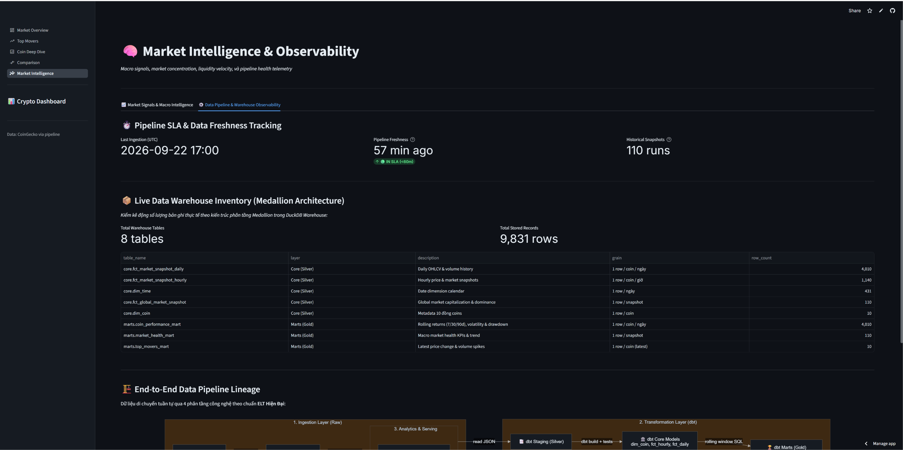 |

### Page Breakdown & Capabilities

- **Home — Market Overview:** Real-time crypto market summary displaying current prices, 24h market trend lines, and high-level market statistics.
- **Page 1 — Top Movers & Volume Scanner:** Real-time ranking of Top Gainers and Losers across the 10 tracked coins. An interactive scatter plot maps 24h price change vs. volume spike ratio — coins simultaneously showing high price moves AND high volume spikes (> 1.5× 7-day average) are highlighted as potential anomalies worth investigating.
- **Page 2 — Coin Deep-Dive:** Interactive OHLCV candlestick chart with MA(7) and MA(30) moving average overlays. Rolling 30-day volatility chart, Max Drawdown from ATH timeline, plus a metadata card from `dim_coin` showing genesis date, categories, and official links.
- **Page 3 — Multi-Coin Comparison:** Normalized performance index (base = 100 at earliest data point) to compare relative growth across all coins without price-scale distortion — comparing a $60K Bitcoin with a $0.00001 SHIB on the same chart. Correlation heatmap of daily returns for portfolio diversification analysis.
- **Page 4 — Market Intelligence & Observability:** Macro market health: global market cap trend, BTC and ETH dominance over time, top-10 concentration ratio. The **Pipeline Observability** panel shows real-time row counts for every warehouse table, physical `crypto.duckdb` file size, and the dbt data lineage graph.

---

## 📂 7. Project Structure

```text
crypto-coin-pipeline/
├── .github/workflows/ci.yml              # CI: Ruff lint + Pytest + dbt compile
├── app/                                  # Streamlit analytics & observability
│   ├── pages/
│   │   ├── 1_top_movers.py              # Top gainers/losers + volume spike scanner
│   │   ├── 2_coin_deep_dive.py          # Interactive OHLCV + volatility + drawdown
│   │   ├── 3_comparison.py             # Normalized performance + correlation heatmap
│   │   └── 4_market_intelligence.py    # Macro KPIs + pipeline observability
│   ├── app.py                           # App entrypoint (st.navigation)
│   ├── main.py                          # Home page — market overview
│   ├── charts.py                        # Plotly chart factory (unified dark theme)
│   ├── db.py                            # DuckDB singleton connection (read_only)
│   ├── queries.py                       # Data access layer — thread-safe, TTL-cached
│   └── theme.py                         # Design tokens, CSS injection, label dicts
├── config/
│   ├── coins.yaml                       # 10 target coins: BTC, ETH, USDT, BNB, SOL,
│   │                                    # XRP, DOGE, ADA, USDC, SHIB
│   └── airflow.cfg                      # Airflow 3.0.2 core configuration
├── dags/
│   ├── ingest_market_snapshot_dag.py    # @hourly: markets+global → S3 → validate → trigger
│   ├── ingest_coin_metadata_dag.py      # @weekly: Dynamic Task Mapping per coin
│   ├── market_chart_incremental_dag.py  # @daily: 7-day sliding OHLCV window
│   ├── market_chart_backfill_dag.py     # Manual: 365-day historical initialization
│   ├── transform_dag.py                 # Triggered: dbt freshness → build + tests
│   └── utils/alerting.py               # HTML email alerting (SMTP / Gmail STARTTLS)
├── dbt/crypto_dwh/
│   ├── macros/generate_schema_name.sql  # Custom schema naming macro for DuckDB
│   ├── models/
│   │   ├── staging/                     # Silver: parse JSON from S3, cast types
│   │   ├── intermediate/               # Dedup + source priority + rolling metrics
│   │   └── marts/
│   │       ├── core/                   # Star schema: dims + facts (contracts enforced)
│   │       ├── coin_performance/       # Rolling returns, volatility, drawdown
│   │       ├── market_health/          # Global macro KPIs + concentration index
│   │       └── top_movers/             # Price change ranking + volume anomaly detect
│   ├── tests/                          # 5 custom financial SQL assertions
│   ├── dbt_project.yml                 # Materialization + schema + tag config
│   └── profiles.yml                    # Targets: dev (MinIO), prod (AWS S3), motherduck
├── docker/
│   ├── airflow/docker-compose.yml      # Airflow 3.0.2 cluster: Celery + Redis + Postgres
│   ├── airflow/dockerfile              # Custom Airflow image with isolated dbt virtualenv
│   └── minio/docker-compose.yml       # MinIO + bucket initialization script
├── ingestion/
│   ├── coingecko_client.py             # Async HTTP client + Semaphore + Tenacity retry
│   ├── s3_writer.py                    # S3/MinIO writer + Hive key generation
│   ├── schemas.py                      # Pydantic v2 schemas: markets, chart, metadata, global
│   └── config.py                       # Loads COIN_IDS from config/coins.yaml
├── tests/
│   ├── test_coingecko_client.py        # Network error + retry behavior
│   ├── test_coingecko_split.py         # API response parsing + normalization
│   ├── test_s3_writer.py               # S3 Hive key generation (Moto mock)
│   └── test_schema.py                  # Pydantic schema edge cases
├── pyproject.toml                       # Project deps, uv/ruff/pytest config
└── .env.example                         # All environment variables with descriptions
```

---

## 🔐 8. Environment Configuration

```bash
cp .env.example .env          # Linux / macOS
Copy-Item .env.example .env   # Windows PowerShell
```

| Variable | Required | Default / Example | Description |
| :--- | :---: | :--- | :--- |
| `COINGECKO_API_KEY` | No | `your-api-key` | CoinGecko Demo or Pro key. Blank = free public tier (lower limits). |
| `S3_BUCKET_NAME` | **Yes** | `crypto-raw-lake` | S3 bucket for the Bronze lake. |
| `S3_ENDPOINT_URL` | **Yes** | `http://localhost:9000` | MinIO endpoint (omit for real AWS S3). |
| `AWS_ACCESS_KEY_ID` | **Yes** | `adminuser` | MinIO / AWS access key. |
| `AWS_SECRET_ACCESS_KEY` | **Yes** | `supersecretpassword123` | MinIO / AWS secret key. |
| `AWS_DEFAULT_REGION` | **Yes** | `ap-southeast-1` | AWS region for S3. |
| `DUCKDB_PATH` | **Yes** | `warehouse/crypto.duckdb` | Path to the DuckDB file on host. |
| `DUCKDB_S3_ENDPOINT` | **Yes** | `localhost:9000` | Host:port for DuckDB httpfs (no `http://` prefix). |
| `AIRFLOW_UID` | **Yes** | `50000` | UID for Airflow container user (Linux/WSL2). |
| `FERNET_KEY` | **Yes** | `(base64 32-byte key)` | Encryption key for Airflow Connections & Variables. |
| `SMTP_HOST` | No | `smtp.gmail.com` | SMTP server for pipeline alert emails. |
| `SMTP_PORT` | No | `587` | SMTP port (587 = STARTTLS). |
| `SMTP_USER` | No | `your-email@gmail.com` | Sender email account. |
| `SMTP_PASSWORD` | No | `16-char-app-password` | Gmail App Password (not your account password). |
| `ALERT_RECEIVERS` | No | `admin@example.com` | Comma-separated alert recipient emails. |

---

## 🚀 9. Quickstart — Run Locally

**Prerequisites:** [Docker Desktop](https://www.docker.com/) (WSL2 backend on Windows, 4GB+ RAM) + [Python 3.12+](https://www.python.org/) + [uv](https://github.com/astral-sh/uv)

### Step 1 — Clone & Configure

```bash
# Linux / macOS
git clone https://github.com/thanhtri271206/crypto-coin-pipeline.git
cd crypto-coin-pipeline && cp .env.example .env
```

```powershell
# Windows PowerShell
git clone https://github.com/thanhtri271206/crypto-coin-pipeline.git
cd crypto-coin-pipeline; Copy-Item .env.example .env
```

Edit `.env` and fill in credentials. MinIO and Airflow values can stay as defaults for local dev.

### Step 2 — Install Dependencies

```bash
uv sync --all-extras   # creates .venv + installs all groups
```

### Step 3 — Start Infrastructure

```bash
docker compose -f docker/minio/docker-compose.yml up -d
docker compose -f docker/airflow/docker-compose.yml up -d
```

| Service | URL | Default credentials |
| :--- | :--- | :--- |
| MinIO Console | http://localhost:9001 | `adminuser` / `supersecretpassword123` |
| Airflow UI | http://localhost:8080 | `airflow` / `airflow` |

### Step 4 — Initialize Historical Data (First Run Only)

1. Airflow UI → unpause `market_chart_backfill` → **Trigger DAG**
2. Fetches 365 days of OHLCV history for all 10 coins into MinIO (~10–20 minutes)
3. After completion → trigger `transform_dag` to build warehouse tables and rolling metrics

### Step 5 — Verify

```bash
uv run pytest          # 17 unit tests
uv run ruff check .    # static analysis
uv run dbt compile --project-dir dbt/crypto_dwh --profiles-dir dbt/crypto_dwh --target dev
```

### Step 6 — Launch Dashboard

```bash
uv run streamlit run app/app.py
# Open http://localhost:8501
```

---

## 🧪 10. Testing & Quality Matrix

| Layer | Technology | Count | Scope |
| :--- | :--- | :--- | :--- |
| Static Analysis | Ruff | All files | PEP8, type hints, import ordering |
| Unit Tests | Pytest + Moto | 17 tests | Retry logic, S3 Hive key generation, API parsing |
| Schema Validation | Pydantic v2 | 4 schemas | Raw JSON types, schema drift resilience |
| Source Freshness | dbt source freshness | 4 sources | S3 data SLA monitoring |
| Generic dbt Tests | dbt-duckdb | 145 tests | unique, not_null, accepted_range, relationships |
| Financial Assertions | Custom SQL | 5 tests | OHLC ordering, return bounds, positive prices, no future timestamps |
| Data Contracts | dbt enforce | 2 tables | Schema contract on dim_coin and dim_time |

CI runs on every push via GitHub Actions: Ruff lint → Pytest → dbt compile.

---

## 🛠️ 11. Operational Runbook & FAQ

<details>
<summary><b>How do I run the initial 1-year historical backfill?</b></summary>

1. Airflow UI → unpause `market_chart_backfill` → **Trigger DAG**
2. Fetches 365 days of OHLCV for all 10 coins (10–20 minutes depending on CoinGecko limits)
3. After completion, trigger `transform_dag` to build `coin_performance_mart` rolling metrics

</details>

<details>
<summary><b>DuckDB IOException: "Could not set lock on file — Resource temporarily unavailable"</b></summary>

DuckDB is file-based — only one process holds the write lock at a time.

`app/db.py` opens DuckDB in `read_only=True` mode and never blocks Airflow's write lock. If using an external tool (DBeaver, DuckDB CLI), connect with `-readonly` flag or close before running dbt.

```bash
duckdb -readonly warehouse/crypto.duckdb
```
</details>

<details>
<summary><b>How do I inspect raw files in MinIO?</b></summary>

```bash
aws --endpoint-url http://localhost:9000 \
    s3 ls s3://crypto-raw-lake/raw/coins/markets/ --recursive
```
Set `AWS_ACCESS_KEY_ID` and `AWS_SECRET_ACCESS_KEY` in your shell from `.env`.
</details>

<details>
<summary><b>How do I completely reset the environment?</b></summary>

```bash
docker compose -f docker/airflow/docker-compose.yml down -v
docker compose -f docker/minio/docker-compose.yml down -v
rm warehouse/crypto.duckdb*
docker compose -f docker/minio/docker-compose.yml up -d
docker compose -f docker/airflow/docker-compose.yml up -d
```
Then re-run Step 4 to reinitialize historical data.
</details>

<details>
<summary><b>How do I deploy to production with AWS S3?</b></summary>

In `.env`, clear `S3_ENDPOINT_URL` and `DUCKDB_S3_ENDPOINT` (use AWS defaults). Set `DBT_TARGET=prod`.

The `prod` profile in `profiles.yml` uses `s3_use_ssl: "true"` and `s3_url_style: "vhost"` for AWS virtual-hosted-style addressing — the opposite of MinIO's path-style.
</details>

---

## 🔮 12. Known Limitations & Engineering Roadmap

Engineering is fundamentally about navigating trade-offs. The current architecture prioritizes low cost, zero maintenance, and lightweight modern data stack performance. To maintain architectural transparency, here are the documented engineering boundaries and the planned evolution path:

| # | Limitation Area | Current State & Technical Constraint | Future Engineering Roadmap |
| :-: | :--- | :--- | :--- |
| **1** | **No Open Table Format (ACID on Lake)** | Bronze storage on MinIO/S3 writes raw JSON files in Hive partitions (`date=YYYY-MM-DD/`). Lacks lake-level ACID transactions, time travel, and snapshot isolation. | Migrate Bronze/Silver storage to **Apache Iceberg** or **Delta Lake** using DuckDB's `iceberg` / `delta` extensions to enable atomic commits, rollbacks, and schema evolution. |
| **2** | **Free-Tier Ingestion & Backfill Granularity** | CoinGecko Public Demo API enforces ~30 calls/min rate limits and aggregates historical candles beyond 90 days. | Implement a multi-exchange fallback provider via **CCXT / Binance Public API** and support API key tier upgrades for high-frequency historical ticks. |
| **3** | **Micro-Batch Latency vs. Real-Time** | Scheduled micro-batches (@hourly, @daily) via Airflow introduce an inherent 1-hour analytical latency. | Architect a **Fast-Path / Kappa Architecture** branch using exchange WebSockets, **Apache Kafka / Redpanda**, and **Apache Flink** for sub-second volatility alerts. |
| **4** | **Single Notification Alerting Channel** | Pipeline task failures notify exclusively through HTML email via SMTP (Gmail STARTTLS). | Integrate instant operational webhooks into **Slack**, **Telegram Bot**, or **PagerDuty** for faster on-call incident response. |
| **5** | **Absence of Ephemeral E2E CI/CD Tests** | GitHub Actions CI validates code style (Ruff), unit mocks (Pytest), and dbt compilation. | Integrate **Testcontainers** into CI to spin up isolated, ephemeral MinIO and DuckDB containers for true End-to-End pipeline execution tests on pull requests. |
| **6** | **DAG Execution Latency & Test Overhead** | `transform_dag` averages ~2m15s (with `dbt build` taking ~80s), and `ingest_market_snapshot` fetch task takes ~20s. Primary drivers: 150+ automated SQL tests running sequentially against MinIO/S3 via `httpfs` over Docker bridge network, combined with Jinja manifest compilation and API rate-limiting margins. | Tune DuckDB thread concurrency (`threads: 4`), decouple the full 150-test financial assertion suite into an asynchronous daily audit DAG (keeping only critical schema checks for hourly runs), and adopt dbt Slim CI (`state:modified`). |

---

## 👤 13. Author & Contact

**Bui Phan Thanh Tri** — Data Engineer

- 📧 [thanhtri270106@gmail.com](mailto:thanhtri270106@gmail.com)
- 🐙 [@thanhtri271206](https://github.com/thanhtri271206)
- 📦 [github.com/thanhtri271206/crypto-coin-pipeline](https://github.com/thanhtri271206/crypto-coin-pipeline)

