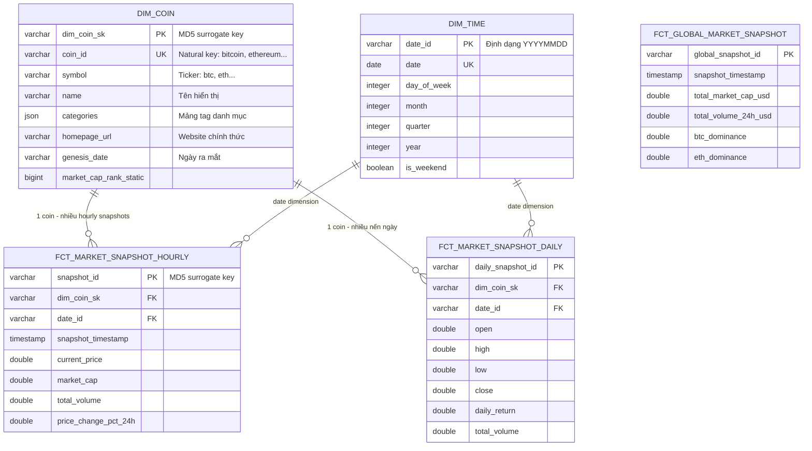

# 🚀 Pipeline Dữ Liệu Thị Trường Crypto End-to-End

### *Modern Data Stack Cấp Production — Kiến Trúc Lakehouse & Observability Thời Gian Thực*

[](https://github.com/thanhtri271206/crypto-coin-pipeline/actions/workflows/ci.yml)
[](https://www.python.org/)
[](https://airflow.apache.org/)
[](https://www.getdbt.com/)
[](https://duckdb.org/)
[](https://min.io/)
[](https://streamlit.io/)
[](https://github.com/astral-sh/ruff)
[](https://pytest.org/)
[](https://www.getdbt.com/)
[](https://opensource.org/licenses/MIT)

> **Also available in:** [🇬🇧 English](README.md)

---

# 🇻🇳 Phiên Bản Tiếng Việt

## 📑 Mục Lục
1. [Tổng Quan & Động Lực Dự Án](#-1-tổng-quan--động-lực-dự-án)
2. [Kiến Trúc Hệ Thống](#️-2-kiến-trúc-hệ-thống)
3. [Lịch Điều Phối Pipeline](#️-3-lịch-điều-phối-pipeline)
4. [Mô Hình Dữ Liệu — Kimball Star Schema](#-4-mô-hình-dữ-liệu--kimball-star-schema)
5. [Điểm Nổi Bật Kỹ Thuật](#-5-điểm-nổi-bật-kỹ-thuật)
6. [Dashboard Phân Tích & Quan Sát](#-6-dashboard-phân-tích--quan-sát)
7. [Cấu Trúc Dự Án](#-7-cấu-trúc-dự-án)
8. [Cấu Hình Môi Trường](#-8-cấu-hình-môi-trường)
9. [Hướng Dẫn Chạy Cục Bộ](#-9-hướng-dẫn-chạy-cục-bộ)
10. [Testing & Quality Matrix](#-10-testing--quality-matrix)
11. [Runbook Vận Hành & FAQ](#️-11-runbook-vận-hành--faq)
12. [Tác Giả & Liên Hệ](#-12-tác-giả--liên-hệ)

---

## 📌 1. Tổng Quan & Động Lực Dự Án

Thị trường tiền mã hóa không bao giờ nghỉ — nó hoạt động **24/7/365** với khối lượng giao dịch khổng lồ và biến động giá liên tục. Xây dựng một nền tảng dữ liệu đủ mạnh để phục vụ phân tích kỹ thuật, nghiên cứu định lượng, và giám sát thị trường đặt ra những bài toán Data Engineering thực sự thú vị.

**Những thách thức cốt lõi dự án này giải quyết:**

- **Ingestion từ API bị rate-limit:** CoinGecko áp đặt giới hạn request nghiêm ngặt (HTTP 429). Nếu không có logic backoff cẩn thận và kiểm soát concurrency, pipeline hoặc bị throttle hoặc lấy thiếu dữ liệu.
- **Idempotency đầu-cuối:** Mọi lần Airflow retry, task rerun, hay backfill lịch sử đều phải cho kết quả như nhau — không tạo file thừa trên lake, không trùng lặp record trong warehouse.
- **Lakehouse tiết kiệm chi phí:** Lưu raw JSON trong Bronze lake phân vùng Hive trên MinIO/S3, rồi query trực tiếp bằng extension `httpfs` của DuckDB — không cần duy trì Spark cluster, không lo hóa đơn Snowflake.
- **Dimensional modeling đúng chuẩn:** Star Schema theo Kimball với enforced data contracts, phân tách rõ Fact/Dimension, và các chỉ số tài chính nâng cao (rolling returns, volatility, max drawdown, volume spike detection).
- **Data quality nhiều tầng:** Hai lớp validation độc lập — Pydantic v2 ngay lúc ingestion, và 150+ automated dbt tests lúc transformation. Dữ liệu xấu không bao giờ chạm đến serving layer.
- **Observability có ý nghĩa:** Cảnh báo HTML email tự động khi Airflow task thất bại, cộng với dashboard trực tiếp hiển thị warehouse inventory, kích thước bảng, và dbt lineage graph.

---

## 🏗️ 2. Kiến Trúc Hệ Thống

### Sơ Đồ Kiến Trúc Tổng Thể


### Data Lineage (dbt tự động sinh)


### Luồng Dữ Liệu Cấp Cao

```
CoinGecko REST API
   ↓ httpx AsyncClient + Semaphore + Tenacity retry
Airflow 3.0.2 Celery Worker (Bronze Layer)
   ↓ Idempotent S3 Writer  →  MinIO / S3  (Hive-partitioned JSON)
   ↓ Pydantic v2 validate-what-you-store
   ↓ TriggerDagRunOperator khi pass
dbt + DuckDB In-Process OLAP (Silver + Gold Layer)
   staging/ → intermediate/ → core/ (dim_coin, dim_time, fct_*)
                             → marts/ (coin_performance, top_movers, market_health)
   ↓ Kết nối read-only thread-safe
Streamlit 1.62 Dashboard + SMTP Alerting Engine
```

### Tech Stack & Lý Do Lựa Chọn

| Thành phần | Công nghệ | Lý do chọn |
| :--- | :--- | :--- |
| **Orchestrator** | **Apache Airflow 3.0.2 (Celery)** | Chuẩn công nghiệp với hệ sinh thái trưởng thành. API Server mới của Airflow 3.0 cho phép trigger task qua REST đúng cách. Celery Executor với Redis broker cho phép thực thi phân tán thực sự — task chạy song song trên worker riêng biệt. Dynamic Task Mapping (`expand()`) là lý do chủ chốt chọn Airflow thay vì các giải pháp đơn giản hơn. |
| **Object Storage** | **MinIO (local) / AWS S3 (prod)** | 100% tương thích S3 API — cùng một codebase chạy cục bộ với MinIO và trên production với AWS S3, chỉ cần đổi biến môi trường. Hive-style partitioning (`date=YYYY-MM-DD`) cho phép DuckDB scan partition pruning hiệu quả. |
| **OLAP Engine** | **DuckDB 1.11+** | Nhân vật chính của kiến trúc. Extension `httpfs` cho phép DuckDB scan trực tiếp JSON/Parquet từ S3 mà không cần copy dữ liệu về. Vectorized columnar execution xử lý hàng trăm nghìn dòng trong mili-giây — tất cả trong một file nhúng duy nhất, không cần cluster, không tốn chi phí hạ tầng. |
| **Data Transformation** | **dbt-duckdb 1.12+** | dbt đưa kỷ luật software engineering vào SQL: version control, lineage graph, automated testing, documentation, và modularity. dbt-duckdb adapter cho phép mount S3 bucket như `external_location` để staging models đọc thẳng từ MinIO. |
| **API Client** | **httpx + asyncio + Tenacity** | `httpx.AsyncClient` với `asyncio.Semaphore(max_concurrency=5)` fetch đồng thời tất cả 10 biểu đồ coin (~5x nhanh hơn sequential). Tenacity xử lý exponential backoff (2s → 10s với jitter) cho HTTP 429 và lỗi mạng. |
| **Schema Validation** | **Pydantic v2** | `ConfigDict(extra="ignore")` là lựa chọn có chủ đích: khi CoinGecko thêm field mới (schema drift), validator âm thầm bỏ qua field không biết thay vì làm vỡ pipeline. Chỉ field được khai báo mới được validate. |
| **BI Dashboard** | **Streamlit 1.62 + Plotly** | Streamlit cho phép xây dashboard analytics hữu ích bằng Python mà không cần frontend stack riêng. Thread-safe cursor pattern và multi-tier TTL cache (5min/1hr/24hr) xử lý nhiều người dùng đồng thời an toàn dù DuckDB có giới hạn single-writer. |
| **Package Manager** | **uv (Astral)** | Viết bằng Rust, nhanh hơn pip 10–100 lần cho dependency resolution. `uv.lock` đảm bảo môi trường tái lập trên dev, CI, và production. |

---

## ⚙️ 3. Lịch Điều Phối Pipeline

Năm DAGs bao phủ toàn bộ vòng đời dữ liệu:

| DAG ID | Lịch | Chức năng |
| :--- | :--- | :--- |
| `ingest_market_snapshot` | @hourly | Fetch giá Top 10 coin + global market data → MinIO → validate Pydantic → trigger dbt |
| `market_chart_incremental` | @daily (00:30 UTC) | Cập nhật nến OHLCV cửa sổ trượt 7 ngày cho tất cả 10 coin |
| `ingest_coin_metadata` | @weekly (CN 00:00) | Dynamic Task Mapping: fetch metadata song song cho từng coin qua `expand()` |
| `market_chart_backfill` | Manual | Một lần duy nhất: nạp 365 ngày lịch sử OHLCV cho mỗi coin |
| `transform_dag` | Triggered | dbt source freshness → dbt build + toàn bộ 150 tests (hỗ trợ selective rebuild) |

**Quyết định thiết kế quan trọng:**

- **`TriggerDagRunOperator`** — `ingest_market_snapshot` tự động trigger `transform_dag` khi thành công, truyền `dbt_selector` qua `conf` để chỉ rebuild subset model bị ảnh hưởng.
- **Selective rebuild** — `transform_dag` đọc `dbt_selector` từ `dag_run.conf`. Một cập nhật metadata sẽ không trigger rebuild lại toàn bộ market snapshot models.
- **Dynamic Task Mapping** — `ingest_coin_metadata` dùng `task.expand(coin_id=COIN_IDS)`, fan-out một task độc lập mỗi coin với retry granularity riêng. Sạch hơn nhiều so với loop trong một task duy nhất.
- **`max_active_tasks=10`** — Tăng từ mặc định 3 để tránh task starvation: 10 coin × 3 task = 30 task tranh 3 slot sẽ dẫn đến timeout.

---

## 🏛️ 4. Mô Hình Dữ Liệu — Kimball Star Schema

### Medallion Architecture

```
🥉 BRONZE — Raw Lakehouse (S3/MinIO)
   Path: raw/{endpoint}/date=YYYY-MM-DD/fetched_at=YYYY-MM-DDTHH-MM-SSZ.json
   • Payload API thô nguyên bản, đúng như nhận từ CoinGecko
   • Hive-partitioned để DuckDB scan partition pruning hiệu quả
   • Giữ mãi làm source of truth — không bao giờ xóa

   ↓  (DuckDB httpfs đọc + dbt staging models parse)

🥈 SILVER — Staging & Intermediate (DuckDB)
   • staging/: SQL views parse JSON bằng DuckDB JSON functions,
     cast types (timestamp, double, varchar), đổi tên cột
   • intermediate/: deduplication qua ROW_NUMBER(), phân giải nguồn
     ưu tiên (snapshot vs. historical chart), tính toán trước rolling windows

   ↓  (dbt marts models build bảng phân tích)

🥇 GOLD — Core Star Schema + Analytical Marts (DuckDB)
   • core/: dim_coin, dim_time, fct_market_snapshot_hourly/daily,
     fct_global_market_snapshot — tất cả có enforced data contracts
   • marts/: coin_performance_mart, top_movers_mart, market_health_mart
     — bảng tổng hợp sẵn sàng phục vụ báo cáo
```

### Sơ Đồ ERD



### Analytical Marts & Business Metrics

| Mart | Granularity | Chỉ số cốt lõi |
| :--- | :--- | :--- |
| **`coin_performance_mart`** | coin × ngày | Rolling returns 7D/30D/90D; Độ biến động (std dev 30 ngày của daily returns); Max Drawdown từ ATH |
| **`top_movers_mart`** | coin (snapshot mới nhất) | Xếp hạng biến động giá 24h & 7d; Volume Spike (`volume_24h / avg_volume_7d > 1.5`); Cờ cực đoan qua IQR upper fence |
| **`market_health_mart`** | snapshot timestamp | Tổng vốn hóa thị trường toàn cầu USD; BTC & ETH dominance %; Tỷ lệ tập trung Top-10; Thay đổi vốn hóa & volume 24h% |

---

## 💡 5. Điểm Nổi Bật Kỹ Thuật

### 1 — Idempotency Xác Định Qua Airflow Logical Date

Sai lầm phổ biến nhất trong data lake pipeline là dùng `datetime.now()` để đặt tên file. Mỗi lần retry tạo file mới, tích lũy thành đống dữ liệu trùng lặp theo thời gian.

Pipeline này sinh S3 key hoàn toàn từ `logical_date` của Airflow (thời gian thực thi đã lên lịch, không phải đồng hồ tường):

```
raw/coins/markets/date=2026-08-15/fetched_at=2026-08-15T00-00-00Z.json
```

Ba lần retry trong cùng một giờ đều ghi vào **đúng cùng S3 key** — lần ghi cuối thắng, sạch sẽ. Backfill một tháng dữ liệu lịch sử sẽ ghi xác định vào đúng partition ngày, không tạo file mồ côi.

### 2 — Async Ingestion với Hai Tầng Phục Hồi

**Tầng 1 — Cấp client:** `httpx.AsyncClient` với `asyncio.Semaphore(max_concurrency=5)` cho phép tối đa 5 API call đồng thời — đủ nhanh để fetch tất cả 10 biểu đồ coin song song, đủ thận trọng không bão hòa rate limit free-tier của CoinGecko. Tenacity xử lý exponential backoff (2s → 10s với jitter) cho HTTP 429 và lỗi mạng.

**Tầng 2 — Cấp orchestrator:** Mỗi task có `retries=3, retry_delay=30s`. Airflow tự xử lý API outage kéo dài vài phút mà không cần can thiệp thủ công.

Hai tầng cover các failure mode khác nhau: Tầng 1 cho network blip thoáng qua, Tầng 2 cho API outage kéo dài.

### 3 — Validate-What-You-Store (Hai Cửa Chặn Chất Lượng)

**Pre-ingestion (Pydantic v2):** Sau khi upload raw JSON lên S3, DAG *đọc lại file từ S3* và validate nó trước khi kích hoạt transformation. Pattern "validate-what-you-store" này xác nhận dữ liệu đã thực sự hạ cánh xuống lake toàn vẹn — không chỉ là response API trông đúng trong bộ nhớ.

`ConfigDict(extra="ignore")` là lựa chọn có chủ đích: schema drift (CoinGecko thêm field mới) được xử lý âm thầm — chỉ field được khai báo mới được validate.

**In-warehouse (150 automated dbt tests):**
- **Generic tests**: `unique`, `not_null`, `accepted_range`, `relationships` trên tất cả bảng Fact và Dimension
- **5 custom financial assertions**:
  - `assert_ohlc_ordering.sql` — đảm bảo `Low ≤ Open, Close ≤ High` cho mỗi nến ngày
  - `assert_daily_return_range.sql` — bắt return < -100% hoặc chia cho 0
  - `assert_price_positive.sql` — không có giá âm
  - `assert_market_cap_rank_positive.sql` — không có rank ≤ 0
  - `assert_no_future_snapshots.sql` — bắt lỗi lệch múi giờ tạo ra record "tương lai"
- **Data contracts**: `dim_coin` và `dim_time` dùng `contract: enforced: true` — thay đổi kiểu dữ liệu cột làm vỡ build ngay lập tức

### 4 — In-Process OLAP Không Cần Cluster

Profile `dbt-duckdb` mount MinIO như `external_location` dùng extension `httpfs`:

```yaml
extensions: [httpfs]
settings:
  s3_endpoint: "localhost:9000"
  s3_url_style: "path"   # MinIO cần path-style, khác với virtual-hosted của AWS
```

Staging models đọc thẳng từ S3:
```sql
SELECT * FROM read_json_auto('s3://crypto-raw-lake/raw/coins/markets/date=*/fetched_at=*.json')
```

Vectorized columnar engine của DuckDB xử lý hoàn toàn trong bộ nhớ — không submit Spark job, không tốn chi phí cluster, không có serialization overhead. Ở quy mô dưới triệu dòng, DuckDB vượt trội Spark đơn giản vì loại bỏ hoàn toàn overhead phân tán.

### 5 — Streamlit Thread-Safe Cho Nhiều Người Dùng

Streamlit chạy trên server đa luồng — nhiều phiên trình duyệt dùng chung một Python process. Chia sẻ một DuckDB connection object duy nhất sẽ trigger race condition khi query đồng thời.

Giải pháp: thread-local cursor pattern trong [`queries.py`](app/queries.py):

```python
def _safe_query(sql: str, params: list | None = None) -> pd.DataFrame:
    conn = get_conn()      # Singleton connection được cache (read-only)
    cur = conn.cursor()    # Cursor mới mỗi lần gọi — isolated per thread
    try:
        return cur.execute(sql, params).fetchdf()
    finally:
        cur.close()        # Luôn release, kể cả khi có exception
```

Kết nối mở một lần trong `read_only=True` mode — unlimited concurrent readers, không bao giờ conflict với write lock của dbt.

Cache TTL tiers ngăn hammer database mỗi lần refresh trang:
- `TTL_REALTIME = 300s` — market snapshots, top movers
- `TTL_DAILY = 3600s` — nến OHLCV ngày, performance metrics
- `TTL_STATIC = 86400s` — dimension tables (danh sách coin, metadata)

### 6 — Selective dbt Rebuild Qua DAG Config

Khi chỉ market snapshot thay đổi (mỗi giờ), không lý gì phải rebuild toàn bộ dbt graph kể cả metadata models hàng tuần. `transform_dag` đọc `dbt_selector` từ `dag_run.conf`:

```python
dbt_selector = conf.get("dbt_selector", "").strip()
cmd = f"dbt build --select {dbt_selector}" if dbt_selector else "dbt build"
```

`ingest_market_snapshot` trigger với `conf={"dbt_selector": "stg_coins_markets+ stg_global+"}` — chỉ model downstream thực sự bị ảnh hưởng mới được rebuild, tiết kiệm đáng kể thời gian thực thi dbt.

---

## 📊 6. Dashboard Phân Tích & Quan Sát

Được xây dựng với **Streamlit 1.62** theo phong cách dark theme tài chính, dashboard 4 trang bao phủ giám sát thị trường từ vĩ mô đến vi mô:

**Trang 1 — Top Movers & Volume Scanner**
Xếp hạng real-time Top Gainers và Losers trong 10 coin đang theo dõi. Scatter plot ánh xạ biến động giá 24h vs. volume spike ratio — những coin vừa có biến động giá lớn vừa có khối lượng đột biến (> 1.5× trung bình 7 ngày) được highlight như potential anomaly đáng điều tra thêm.

**Trang 2 — Coin Deep-Dive**
Biểu đồ nến OHLCV tương tác với overlay MA(7) và MA(30). Biểu đồ Rolling 30-day Volatility, Max Drawdown từ ATH theo thời gian, và card metadata từ `dim_coin` hiển thị ngày ra mắt, danh mục, và liên kết chính thức.

**Trang 3 — Multi-Coin Comparison**
Chỉ số performance chuẩn hóa (base = 100 tại điểm dữ liệu sớm nhất) để so sánh tăng trưởng tương đối giữa các coin mà không bị lệch vì chênh lệch giá — so sánh Bitcoin $60K với SHIB $0.00001 trên cùng trục. Correlation heatmap của daily returns để phân tích đa dạng hóa danh mục đầu tư.

**Trang 4 — Market Intelligence & Observability**
Sức khỏe vĩ mô: xu hướng tổng vốn hóa thị trường toàn cầu, BTC và ETH dominance theo thời gian, tỷ lệ tập trung Top-10. Mục **Pipeline Observability** hiển thị real-time số bản ghi cho mỗi bảng trong warehouse, kích thước vật lý file `crypto.duckdb`, và đồ thị dbt data lineage.

---

## 📂 7. Cấu Trúc Dự Án

```text
crypto-coin-pipeline/
├── .github/workflows/ci.yml              # CI: Ruff + Pytest + dbt compile
├── app/                                  # Streamlit analytics & observability
│   ├── pages/
│   │   ├── 1_top_movers.py              # Top gainers/losers + volume spike scanner
│   │   ├── 2_coin_deep_dive.py          # OHLCV tương tác + volatility + drawdown
│   │   ├── 3_comparison.py             # Performance chuẩn hóa + correlation heatmap
│   │   └── 4_market_intelligence.py    # Macro KPIs + pipeline observability
│   ├── app.py                           # Điểm khởi chạy (st.navigation)
│   ├── main.py                          # Trang tổng quan thị trường
│   ├── charts.py                        # Plotly chart factory (dark theme thống nhất)
│   ├── db.py                            # DuckDB singleton connection (read_only)
│   ├── queries.py                       # Data access layer — thread-safe + TTL cache
│   └── theme.py                         # Design tokens, CSS injection, từ điển nhãn
├── config/
│   ├── coins.yaml                       # 10 coin mục tiêu: BTC, ETH, USDT, BNB, SOL,
│   │                                    # XRP, DOGE, ADA, USDC, SHIB
│   └── airflow.cfg                      # Cấu hình lõi Airflow 3.0.2
├── dags/
│   ├── ingest_market_snapshot_dag.py    # @hourly: markets+global → S3 → validate → trigger
│   ├── ingest_coin_metadata_dag.py      # @weekly: Dynamic Task Mapping mỗi coin
│   ├── market_chart_incremental_dag.py  # @daily: OHLCV cửa sổ trượt 7 ngày
│   ├── market_chart_backfill_dag.py     # Manual: khởi tạo 365 ngày lịch sử
│   ├── transform_dag.py                 # Triggered: dbt freshness → build + tests
│   └── utils/alerting.py               # HTML email alerting (SMTP / Gmail STARTTLS)
├── dbt/crypto_dwh/
│   ├── macros/generate_schema_name.sql  # Macro tùy biến đặt tên schema DuckDB
│   ├── models/
│   │   ├── staging/                     # Silver: parse JSON từ S3, cast types
│   │   ├── intermediate/               # Dedup + source priority + rolling metrics
│   │   └── marts/
│   │       ├── core/                   # Star schema: dim + fact (enforced contracts)
│   │       ├── coin_performance/       # Rolling returns, volatility, drawdown
│   │       ├── market_health/          # Global macro KPIs + concentration index
│   │       └── top_movers/             # Xếp hạng biến động + phát hiện volume anomaly
│   ├── tests/                          # 5 custom financial SQL assertions
│   ├── dbt_project.yml                 # Materialization + schema + tag config
│   └── profiles.yml                    # Targets: dev (MinIO), prod (AWS S3), motherduck
├── docker/
│   ├── airflow/docker-compose.yml      # Cụm Airflow 3.0.2: Celery + Redis + Postgres
│   ├── airflow/dockerfile              # Image Airflow tùy biến với dbt virtualenv riêng
│   └── minio/docker-compose.yml       # MinIO + script khởi tạo bucket tự động
├── ingestion/
│   ├── coingecko_client.py             # Async HTTP client + Semaphore + Tenacity retry
│   ├── s3_writer.py                    # S3/MinIO writer + Hive key generation
│   ├── schemas.py                      # Pydantic v2: markets, chart, metadata, global
│   └── config.py                       # Load COIN_IDS từ config/coins.yaml
├── tests/
│   ├── test_coingecko_client.py        # Xử lý lỗi mạng + retry behavior
│   ├── test_coingecko_split.py         # Parse + chuẩn hóa API response
│   ├── test_s3_writer.py               # Hive key generation (Moto S3 mock)
│   └── test_schema.py                  # Pydantic schema edge cases
├── pyproject.toml                       # Project deps + uv/ruff/pytest config
└── .env.example                         # Template toàn bộ biến môi trường
```

---

## 🔐 8. Cấu Hình Môi Trường

```bash
cp .env.example .env          # Linux / macOS
Copy-Item .env.example .env   # Windows PowerShell
```

| Biến | Bắt buộc | Giá trị mặc định / Mẫu | Mô tả |
| :--- | :---: | :--- | :--- |
| `COINGECKO_API_KEY` | Không | `your-api-key` | API Key CoinGecko (Demo/Pro). Để trống = free public tier. |
| `S3_BUCKET_NAME` | **Có** | `crypto-raw-lake` | Tên S3 bucket cho Bronze lake. |
| `S3_ENDPOINT_URL` | **Có** | `http://localhost:9000` | Endpoint MinIO cục bộ (bỏ trống cho AWS S3 thật). |
| `AWS_ACCESS_KEY_ID` | **Có** | `adminuser` | Access key MinIO / AWS. |
| `AWS_SECRET_ACCESS_KEY` | **Có** | `supersecretpassword123` | Secret key MinIO / AWS. |
| `AWS_DEFAULT_REGION` | **Có** | `ap-southeast-1` | AWS region cho S3. |
| `DUCKDB_PATH` | **Có** | `warehouse/crypto.duckdb` | Đường dẫn file DuckDB trên host. |
| `DUCKDB_S3_ENDPOINT` | **Có** | `localhost:9000` | Host:port cho DuckDB httpfs (không có tiền tố `http://`). |
| `AIRFLOW_UID` | **Có** | `50000` | UID user chạy container Airflow (Linux/WSL2). |
| `FERNET_KEY` | **Có** | `(base64 32-byte key)` | Khóa mã hóa Connection & Variable trong Airflow DB. |
| `SMTP_HOST` | Không | `smtp.gmail.com` | Máy chủ SMTP cho email cảnh báo. |
| `SMTP_PORT` | Không | `587` | Port SMTP (587 = STARTTLS). |
| `SMTP_USER` | Không | `your-email@gmail.com` | Tài khoản email gửi cảnh báo. |
| `SMTP_PASSWORD` | Không | `16-char-app-password` | Gmail App Password (không phải mật khẩu tài khoản). |
| `ALERT_RECEIVERS` | Không | `admin@example.com` | Danh sách email nhận cảnh báo (phân cách bằng dấu phẩy). |

---

## 🚀 9. Hướng Dẫn Chạy Cục Bộ

**Yêu cầu:** [Docker Desktop](https://www.docker.com/) (WSL2 backend trên Windows, 4GB+ RAM) + [Python 3.12+](https://www.python.org/) + [uv](https://github.com/astral-sh/uv)

### Bước 1 — Clone & Cấu Hình

```bash
# Linux / macOS
git clone https://github.com/thanhtri271206/crypto-coin-pipeline.git
cd crypto-coin-pipeline && cp .env.example .env
```

```powershell
# Windows PowerShell
git clone https://github.com/thanhtri271206/crypto-coin-pipeline.git
cd crypto-coin-pipeline; Copy-Item .env.example .env
```

Chỉnh sửa `.env` và điền credentials. Thông tin MinIO và Airflow có thể giữ nguyên mặc định cho local dev.

### Bước 2 — Cài Đặt Dependencies

```bash
uv sync --all-extras   # tạo .venv + cài tất cả dependency groups
```

### Bước 3 — Khởi Động Hạ Tầng

```bash
docker compose -f docker/minio/docker-compose.yml up -d
docker compose -f docker/airflow/docker-compose.yml up -d
```

| Dịch vụ | URL | Thông tin đăng nhập |
| :--- | :--- | :--- |
| MinIO Console | http://localhost:9001 | `adminuser` / `supersecretpassword123` |
| Airflow UI | http://localhost:8080 | `airflow` / `airflow` |

### Bước 4 — Khởi Tạo Dữ Liệu Lịch Sử (Chỉ Lần Đầu)

1. Airflow UI → bật `market_chart_backfill` → nhấn **Trigger DAG**
2. Nạp 365 ngày lịch sử OHLCV cho tất cả 10 coin vào MinIO (~10–20 phút)
3. Sau khi hoàn thành → trigger `transform_dag` để build warehouse tables và tính rolling metrics

### Bước 5 — Kiểm Tra

```bash
uv run pytest          # 17 unit tests
uv run ruff check .    # static analysis
uv run dbt compile --project-dir dbt/crypto_dwh --profiles-dir dbt/crypto_dwh --target dev
```

### Bước 6 — Khởi Chạy Dashboard

```bash
uv run streamlit run app/app.py
# Mở http://localhost:8501
```

---

## 🧪 10. Testing & Quality Matrix

| Tầng kiểm thử | Công nghệ | Số lượng | Phạm vi xác thực |
| :--- | :--- | :--- | :--- |
| Static Analysis | Ruff | Toàn bộ | PEP8, type hints, import ordering |
| Unit Tests | Pytest + Moto | 17 tests | Retry logic, S3 Hive key generation, API parsing |
| Schema Validation | Pydantic v2 | 4 schemas | Kiểu dữ liệu thô, schema drift resilience |
| Source Freshness | dbt source freshness | 4 sources | Giám sát SLA dữ liệu S3 |
| Generic dbt Tests | dbt-duckdb | 145 tests | unique, not_null, accepted_range, relationships |
| Financial Assertions | Custom SQL | 5 tests | OHLC ordering, return bounds, giá dương, không timestamp tương lai |
| Data Contracts | dbt enforce | 2 tables | Schema contract trên dim_coin và dim_time |

CI chạy trên mỗi push qua GitHub Actions: Ruff lint → Pytest → dbt compile.

---

## 🛠️ 11. Runbook Vận Hành & FAQ

<details>
<summary><b>Làm sao để chạy backfill dữ liệu lịch sử một năm?</b></summary>

1. Airflow UI → bật `market_chart_backfill` → nhấn **Trigger DAG**
2. Fetch 365 ngày lịch sử giá cho tất cả 10 coin vào MinIO (10–20 phút tùy rate limit CoinGecko)
3. Sau khi thành công, trigger `transform_dag` để populate warehouse tables và tính rolling metrics

</details>

<details>
<summary><b>Gặp lỗi DuckDB IOException: "Could not set lock on file"</b></summary>

DuckDB là file-based — chỉ một process giữ write lock tại một thời điểm.

`app/db.py` mở DuckDB ở `read_only=True` mode, không bao giờ block write lock của Airflow khi dbt chạy. Nếu dùng công cụ ngoài (DBeaver, DuckDB CLI), kết nối với flag `-readonly` hoặc đóng trước khi chạy dbt.

```bash
duckdb -readonly warehouse/crypto.duckdb
```
</details>

<details>
<summary><b>Làm sao kiểm tra raw file đang có trong MinIO?</b></summary>

```bash
aws --endpoint-url http://localhost:9000 \
    s3 ls s3://crypto-raw-lake/raw/coins/markets/ --recursive
```
Đặt `AWS_ACCESS_KEY_ID` và `AWS_SECRET_ACCESS_KEY` trong shell từ file `.env`.
</details>

<details>
<summary><b>Làm sao reset hoàn toàn môi trường?</b></summary>

```bash
docker compose -f docker/airflow/docker-compose.yml down -v
docker compose -f docker/minio/docker-compose.yml down -v
rm warehouse/crypto.duckdb*
docker compose -f docker/minio/docker-compose.yml up -d
docker compose -f docker/airflow/docker-compose.yml up -d
```
Sau đó làm lại Bước 4 để khởi tạo lại dữ liệu lịch sử.
</details>

<details>
<summary><b>Làm sao deploy lên production với AWS S3 thật?</b></summary>

Trong `.env`, để trống `S3_ENDPOINT_URL` và `DUCKDB_S3_ENDPOINT` (dùng AWS defaults). Đặt `DBT_TARGET=prod`.

Profile `prod` trong `profiles.yml` dùng `s3_use_ssl: "true"` và `s3_url_style: "vhost"` cho AWS virtual-hosted-style addressing — ngược với MinIO cần path-style.
</details>

---

## 👤 12. Tác Giả & Liên Hệ

**Bùi Phan Thanh Trí** — Data Engineer

- 📧 [thanhtri270106@gmail.com](mailto:thanhtri270106@gmail.com)
- 🐙 [@thanhtri271206](https://github.com/thanhtri271206)
- 📦 [github.com/thanhtri271206/crypto-coin-pipeline](https://github.com/thanhtri271206/crypto-coin-pipeline)
